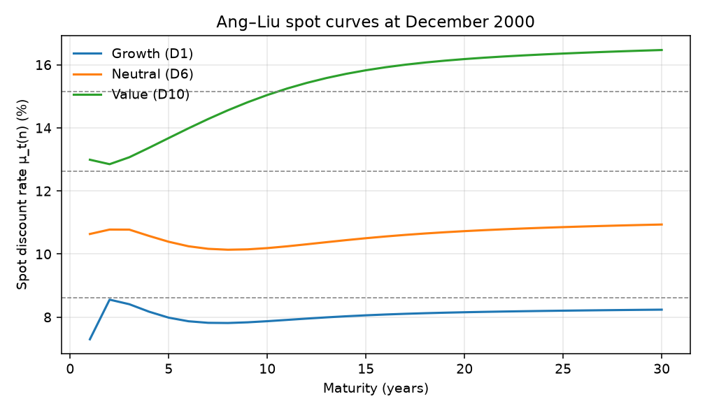
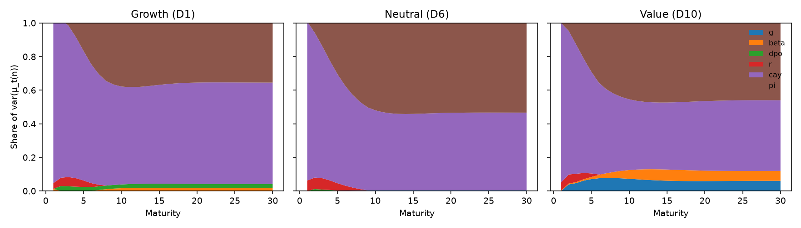

# Ang and Liu (2004)

A valuator is asked for three numbers: a risk-free rate, a market premium, and a beta. [Ang and Liu (2004)](../references.md#ang-liu-2004) start from the fact that *none of the three is constant*, and that cash flows move with them. The one-period expected return is a product,

$$
\mu_t = \alpha + r_t + \beta_t\lambda_t.
$$

If only $\beta$ or only $\lambda$ moves, an affine present-value model is enough. When both move, $\mu_t$ is *quadratic* in the state and the priced strip carries an $H(n)$ matrix (their Proposition I.1). A Gordon formula takes a single $r$ outside the expectation. That is legitimate only if tomorrow’s $\mu$ is known today. It is not. The object that remains is equation (2): value is $E[\text{discount path}\times\text{cash flow}]$. The practical output is Brennan’s term structure of discount rates $\mu_t(n)$, made analytic.

December 2000 is not an arbitrary end date. It is the end of the boom. Fama and French (2002) and Jagannathan, McGrattan, and Scherbina (2001) had just argued that the equity premium had compressed, from the 7-8% of the previous decades toward something like 2%. Consumption was low relative to wealth, so $\mathit{cay}$ was low, so $\lambda_t$ was low. A curve that mean-reverts toward a higher long-run rate must then *slope up*, and a constant historical CAPM must sit *above* that curve. That is the picture §IV asks you to see. This page rebuilds it.

The earlier course pages used a synthetic state (seed 7). This page uses *their* state, *their* window, and *their* valuation date. A single command runs the whole path. The sections below are that command, unpacked.

```text
uv add "varvaluation[data]"
uv run python examples/reproduce_angliu2004.py
```


Run it offline, with no downloads, by passing `--synthetic`. Stop at the paper sample with `--paper-only`. Use Compustat $\Delta p$ with `--wrds`, which needs the `[wrds]` extra and credentials.

---

## Public files

Ken French value-weight book-to-market deciles, with and without dividends, plus the macro block: FF3, the one-year Treasury, CPI, and $\mathit{cay}$. Nothing here is WRDS.

```python
from varvaluation.data import load_bm_deciles, load_macro, prepare_portfolio_state

total, capgains = load_bm_deciles()
macro = load_macro()
```

On the vintage this page was built from, the BE/ME deciles run from July 1926 to June 2026, the macro block (FF3, GS1, CPI) covers the same window, and $\mathit{cay}$ (the published series, or a FRED reconstruction if that file is missing) runs from January 1959 to January 2026.

The paper’s *estimation* window is shorter. Cut it in the next step, not here. Beta needs sixty months of history before July 1965.

---

## Name the state and cut the sample

Their six coordinates, overlapping annual pairs, Newey-West 12:

```python
from datetime import date
from varvaluation.angliu import BM_START, PAPER_END, VALUATION_DATE, paper_spec

spec = paper_spec()
# StateSpec(names=("g","beta","dpo","r","cay","pi"),
#           cashflow="g", horizon=12, nw_lags=12)

state = prepare_portfolio_state(
    total, capgains, macro, spec,
    portfolio="D6",              # growth D1, neutral D6, value D10
    start=BM_START,              # "1965-07"
    end=PAPER_END,               # "2000-12"
)
```

$g$ is Hodrick trailing-twelve-month log dividend growth: `total − capgains`, summed twelve months, then $\log(D_t/D_{t-12})$. $\beta$ is a sixty-month rolling CAPM whose window ends at $t-1$, estimated on log excess returns against the FF market. $\Delta p$, stored as `dpo`, is Compustat earnings in the paper; on this public path it is a capital-gains proxy, and Compustat if you pass `--wrds`. $r$ is the one-year rate, continuously compounded, from FRED GS1 as $\log(1+y)$. $\mathit{cay}$ is Lettau-Ludvigson, from the published CSV or a FRED reconstruction. $\pi$ is twelve-month log CPI, from FRED CPIAUCSL.

There are $n=426$ monthly observations for each decile from July 1965 to December 2000. The valuation date is 31 December 2000.

Why these six, and not a dividend yield? The state has to carry *both sides of the product*. $g$ is the cash-flow coordinate. $r$, $\beta$, and $\lambda(\mathit{cay})$ are the three moving pieces of $\mu_t$. Inflation is there so a long-horizon rate can be split into a real piece and a persistent nominal piece. The paper’s variance tables distinguish nominal, ex ante real, and ex post real. $\Delta p$ maps earnings into dividends, so it can correlate cash flows with the premium. Book-to-market deciles are the cross-section because Ferson and Harvey (1999) had already shown that those portfolios’ betas move, and because a valuator who uses one WACC for "the market" is using the wrong rate for both legs of the value-growth book.

The one construction that is not theirs is `dpo`. Keep going. The check for that is the last section.

---

## The premium $\lambda_t$

One overlapping annual regression, not a second VAR:

$$
y^m_{t+1} - r_t = b_0 + b_r r_t + b_{\mathit{cay}}\,\mathit{cay}_t + \varepsilon_{t+1}.
$$

```python
from varvaluation.angliu import (
    expected_return_loadings, fit_premium, lambda_series,
)

rp = fit_premium(macro, BM_START, PAPER_END)
xi, Lambda = expected_return_loadings(spec, rp)
lam = lambda_series(macro, rp)
```

`ExpectedReturnSpec(premium=("cay",))` turns $(b_0,b_r,b_{\mathit{cay}})$ into $(\xi,\Lambda)$ so that

$$
\mu_t = \alpha + r_t + \beta_t\lambda_t = \alpha + \xi'X_t + X_t'\Lambda X_t.
$$

**Table. Risk premium, Ken French market, July 1965 - December 2000.** $n=426$, $R^2=0.187$.

| | estimate | s.e. | $t$ |
|---|---:|---:|---:|
| $b_0$ | $+0.095$ | $0.062$ | $1.52$ |
| $b_r$ | $-0.59$ | $0.89$ | $-0.66$ |
| $b_{\mathit{cay}}$ | $+3.02$ | $0.96$ | $3.16$ |

$\mathit{cay}$ is the in-sample instrument they used: when consumption is low relative to the wealth and labour-income trend, expected excess returns are high ([Lettau and Ludvigson, 2001](../references.md#lettau-ludvigson-2001)). $b_{\mathit{cay}}>0$ is that claim, and it is the only slope in the table with $|t|>2$. The short-rate slope is the classical Fama-Schwert sign (high $r$ today, low excess returns tomorrow), but it is not identified here. $\alpha$ is not in this table. It is the portfolio’s own annualised CAPM intercept, computed next. It shifts every spot rate by a constant. It does not make the curve slope.

The fitted $\lambda_t$ at the sample mean of $(\bar r,\overline{\mathit{cay}})$ is only about 4%. That is already the late-sample compression the paper is about. A textbook WACC that still uses an 8% historical premium is answering a different question.

---

## One VAR per portfolio

```python
from varvaluation import ValuationModel, estimate_var
from varvaluation.angliu import capm_alpha, constant_capm_rate

alpha, beta_capm = capm_alpha(total, macro, "D6", start=BM_START, end=PAPER_END)
fit = estimate_var(state, spec)
model = ValuationModel.from_var(fit, xi=xi, Lambda=Lambda, alpha=alpha)

X = state.select(list(spec.names)).filter(
    state["date"] <= VALUATION_DATE
).to_numpy()[-1]
```

`from_var` refuses a companion with spectral radius $\ge 1$. On this vintage every decile is inside: $\rho(\Phi)=0.75$ (D1), $0.74$ (D6), $0.82$ (D10).

**Table. Companion $\Phi$ for Neutral (D6), paper sample.** Newey-West s.e. in parentheses. Row = equation, column = lag.

| eq | $g$ | $\beta$ | $\Delta p$ | $r$ | $\mathit{cay}$ | $\pi$ |
|---|---:|---:|---:|---:|---:|---:|
| $g$ | $-0.32$ | $+0.00$ | $-0.01$ | $-0.94$ | $-0.17$ | $+0.85$ |
| | $(0.12)$ | $(0.26)$ | $(0.09)$ | $(0.76)$ | $(0.54)$ | $(0.58)$ |
| $\beta$ | $+0.01$ | $+0.42$ | $-0.02$ | $+0.53$ | $-0.54$ | $-0.53$ |
| $r$ | $+0.06$ | $+0.03$ | $-0.04$ | $+0.57$ | $+0.02$ | $+0.26$ |
| $\mathit{cay}$ | $-0.01$ | $-0.01$ | $-0.02$ | $-0.01$ | $+0.56$ | $+0.21$ |
| $\pi$ | $+0.03$ | $+0.07$ | $-0.03$ | $-0.16$ | $-0.11$ | $+0.89$ |

Own-lags on $r$, $\mathit{cay}$, and $\pi$ are the persistent block. Those are the coordinates that still have something to say at $n=30$: a shock today is still inside $X_{t+30}$. The $g$ row is noisy. Postwar dividend growth is close to unforecastable (the Campbell-Shiller / Cochrane split), and that is the cash-flow equation on overlapping annual dividends, not a bug.

The off-diagonals are the covariance the product identity needs. $\Phi_{\mathit{cay},\pi}$ and $\Phi_{r,\pi}$ say that inflation shocks move the premium state and the short rate. $\Phi_{g,\cdot}$ says whether growth is expected to rise when the discount rate rises. If those cells were zero by construction (two separate models), the $-2\,\mathrm{Cov}(\sum g,\sum\mu)$ term in the price would be missing. The recursion never computes that covariance by hand. It reads it off $\Phi$ and $\Sigma$.

---

## The spot curve at December 2000

```python
curve = model.spot_curve(X, n=30)          # Polars: maturity, mu, …
rates = model.spot_rates(X, n=30)

# Identity that must hold:
assert abs(rates[0] - (alpha + xi @ X + X @ Lambda @ X)) < 1e-12
```

**Table. $\mu_t(n)$ on 31 December 2000.**

| Portfolio | $\mu(1)$ | $\mu(5)$ | $\mu(10)$ | $\mu(30)$ | slope 30−1 |
|---|---:|---:|---:|---:|---:|
| Growth (D1) | 7.30% | 7.98% | 7.87% | 8.24% | $+0.94$ pp |
| Neutral (D6) | 10.64% | 10.39% | 10.19% | 10.94% | $+0.30$ pp |
| Value (D10) | 12.99% | 13.68% | 15.04% | 16.47% | $+3.48$ pp |

The identity holds to machine precision on all three. All three slopes are positive. That is the paper’s December 2000 picture.

### Why the curve slopes up

$\mu_t(n)$ is the rate that prices the $n$-year strip, given today’s $X_t$. Under stationarity it converges to a long-run rate that does not depend on $X_t$. At the end of 2000, $X_t$ is a *low-$\lambda$* state: $\mathit{cay}$ is below its mean, so $\mu_t(1)$ sits below the unconditional rate. The curve is the expected path of $\mu$ as $X$ mean-reverts. An upward slope is the statement "the premium is temporarily cheap; it will not stay this low for thirty years." A downward slope would be the opposite date: a high-$\mathit{cay}$, high-$r$ recession, when today’s one-period rate already capitalizes a lot of risk.

### Why value sits above growth

D10’s whole curve is 5-8 points above D1’s. That is the value premium written as a discount curve rather than as an average return. Growth at the peak of the boom has a low $\beta$ and a negative $\alpha$ in this vintage ($\alpha_{\mathrm{D1}}=-2.4\%$, $\alpha_{\mathrm{D10}}=+4.5\%$): the market was paying up for duration. Value’s curve is also *steeper* ($+3.5$ pp vs $+0.9$ pp). High-$\beta$ names load more on the mean-reversion of $\lambda_t$, so the same compressed premium lifts their long rates more once $\mathit{cay}$ is expected to recover. One WACC for "equities" is the wrong rate for both legs, and the wrong rate at year 1 *and* at year 30.


<p class="figure-caption"><strong>Figure 1.</strong> $\mu_t(n)$ for D1 / D6 / D10 at the paper’s valuation date. Dashed lines are each portfolio’s constant CAPM rate $\alpha+\bar r+\bar\beta\,\bar\lambda$. The gap between the solid curve and the dash is the object §IV is about. Source: <code>examples/reproduce_angliu2004.py</code>.</p>

---

## Unit perpetuity versus a flat rate

They value a perpetuity of an *expected* cash flow of $1. The cash-flow recursion is switched off on purpose. The comparison is then purely the *denominator*: given the same unit cash-flow path, how much does a time-varying curve change the price relative to a single rate? That is how they can talk about misvaluation from ignoring moving expected returns without taking a stand on growth forecasts. A real project still needs a numerator. This table is not that valuation.

```python
from varvaluation.angliu import perpetuity_comparison

capm_rate = constant_capm_rate(state, lam, alpha=alpha, beta_capm=beta_capm)
perp = perpetuity_comparison(model, X, capm_rate=capm_rate)
# perp["v_ts"], perp["v_capm"], perp["gap_capm_pct"]
```

The gap is $(V_{\mathrm{flat}}-V_{\mathrm{TS}})/V_{\mathrm{TS}}$. Negative means the flat rate *undervalues*.

**Table. Unit perpetuity at December 2000.**

| Portfolio | $V_{\mathrm{TS}}$ | $V_{\mathrm{CAPM}}$ | gap | $\mu_{\mathrm{CAPM}}$ |
|---|---:|---:|---:|---:|
| Growth (D1) | 11.81 | 11.11 | **−5.9%** | 8.62% |
| Neutral (D6) | 8.95 | 7.44 | **−16.9%** | 12.62% |
| Value (D10) | 6.19 | 6.11 | **−1.3%** | 15.16% |

A negative gap means the flat rate undervalues. The economics is duration. A perpetuity has duration $1/\mu$; a two- or three-point error in the rate, held forever, is a large error in the price. D6 shows the biggest gap (−17%) because its constant CAPM (12.6%) sits well above a curve that lives around 10-11%. D10’s gap is tiny (−1%) even though its curve is steep: the flat rate (15.2%) is already close to a curve that starts at 13% and rises to 16%. Growth’s gap is moderate because both the curve and the CAPM are low. The cross-section of *gaps* is a different object from the cross-section of *levels*.

Same sign as the paper, and a smaller percentage than their "over 50%": they compared to a textbook historical DDM rate, a large sample premium applied as a constant. This table compares to the model’s own constant CAPM, where the fitted $\bar\lambda$ is only about 4%. We do not inflate that constant to chase 50%. The 50% is what a valuator who still uses the 1980s premium at the peak of the boom would have missed. The 6-17% is what remains when the constant is the model’s own average.

**Table. Share of $\mathrm{var}(\mu_t(n))$ at $n=1$ and $n=30$ (D6).**

| $n$ | $g$ | $\beta$ | $\Delta p$ | $r$ | $\mathit{cay}$ | $\pi$ |
|---:|---:|---:|---:|---:|---:|---:|
| 1 | 0 | −1 | 0 | 6 | **95** | 0 |
| 30 | 0 | −2 | −1 | −1 | 46 | **58** |

This is the attribution §IV is built on. It is a *horizon* statement, not a horse race.

Near cash flows, at $n=1$, almost all of the movement in $\mu_t(1)$ is $\lambda_t$, and $\lambda_t$ is $\mathit{cay}$. If you are discounting next year’s dividend, getting the *current* premium right is the whole job. A stale historical premium is the wrong number at the short end.

Distant cash flows, at $n=30$, are a different object. The shock has to survive inside $X$ for thirty years to still move $\mu_t(30)$. Persistent inflation (and, in the paper, the short rate and $\beta$) take over. A 30-year project lives through many premium cycles; what remains is the slow nominal block. On this vintage inflation outranks rolling $\beta$ at the long end. The paper’s qualitative split, premium near and rates or loadings far, is the same split. The long-end *name* is $\pi$ rather than $\beta$.

$g$ and $\Delta p$ contributing almost nothing to $\mathrm{var}(\mu)$ does not mean cash flows do not matter for *prices*. They are the numerator. This decomposition is of the *curve*, not of returns or of $P$.


<p class="figure-caption"><strong>Figure 2.</strong> Share of $\mathrm{var}(\mu_t(n))$ by state, D1 / D6 / D10. Short end is $\mathit{cay}$. Long end is $\mathit{cay}$ and $\pi$.</p>

Industries on the same recipe, January 1964 to December 2000: Food, Oil, Rtail, and Banks are upward and below CAPM, with gaps from −8% to −27%. Util is refused ($\rho(\Phi)=1.03$). Softw has no trailing-dividend pairs. Steel slopes down because $\alpha=-4.7\%$ pins $\mu(1)$ above the tail. Failures are printed, not dropped.

---

## The same system after 2000

This section is not in the 2004 paper. Re-estimate on July 1965 through the latest $\mathit{cay}$ (January 2026 on this vintage) and value at the *last* month.

```python
rp_long = fit_premium(macro, BM_START, "2026-01")
xi_long, Lam_long = expected_return_loadings(spec, rp_long)

state_long = prepare_portfolio_state(
    total, capgains, macro, spec,
    portfolio="D6", start=BM_START, end="2026-01",
)
# then estimate_var / from_var / spot_rates as above, at state_long["date"][-1]
```

**Table. Premium, long sample.** $n=720$, $R^2=0.050$.

| | estimate | $t$ |
|---|---:|---:|
| $b_0$ | $+0.096$ | $3.47$ |
| $b_r$ | $-0.74$ | $-1.51$ |
| $b_{\mathit{cay}}$ | $+0.67$ | $1.65$ |

The $\mathit{cay}$ slope that was $t=3.16$ on 1965-2000 is $t=1.65$ here. That is the Goyal-Welch fade, not a software defect.

**Table. Spot curve at January 2026 (long-sample companion).**

| Portfolio | $\mu(1)$ | $\mu(30)$ | slope | TS gap vs CAPM |
|---|---:|---:|---:|---:|
| Growth (D1) | 4.74% | 8.38% | $+3.65$ pp | **−17.3%** |
| Neutral (D6) | 6.99% | 10.42% | $+3.42$ pp | **−15.9%** |
| Value (D10) | 7.40% | 11.33% | $+3.93$ pp | **−19.9%** |

The term-structure gap survived. It is larger than at December 2000. January 2026 is another low-$r$, low-$\lambda$ date: the same *configuration* as the end of the boom, held for longer. A flat CAPM at the 1965-2026 sample mean is then too high at every horizon, and worse for a growth name whose cash flows sit out where the curve has not yet climbed back to that mean.

That is the paper’s practical claim, restated for a new date: the rate at year ten is not today’s short rate, and it is not the historical average. It is a forecast that mean-reverts at the speed $\Phi$ estimates. When today’s $X_t$ is a cheap-premium state, using the historical average is the same mistake they documented in December 2000. The $\mathit{cay}$ slope fading to $t=1.65$ makes $\lambda_t$ move *less*. It does not make the short rate constant, and it does not make $\mu_t(1)=\mu_t(30)$.

---

## Compustat $\Delta p$ (optional, WRDS)

The paper’s payout state uses Compustat earnings. The public path proxies earnings growth with the annual capital-gains return. Those are not the same series.

```text
uv add "varvaluation[data,wrds]"
uv run python examples/reproduce_angliu2004.py --wrds
```

```python
from varvaluation.angliu.payout import (
    attach_compustat_dpo, crsp_vw_returns, market_compustat_dpo, proxy_vs_compustat,
)

total_m, cap_m = crsp_vw_returns(start="1960-01", end="2000-12-31")
dpo_cs = market_compustat_dpo(start="1960-01", end="2000-12-31")
proxy_vs_compustat(total_m, cap_m, dpo_cs, portfolio="MKT")
# n=445, corr=−0.12, sd proxy=0.16, sd Compustat=0.08
```

This is a *market* aggregate (TTM CRSP dividends over TTM Compustat NI), not a rebuilt French decile. Correlation −0.12. The proxy is not a stand-in.

The *curve* is more robust. On the CRSP value-weighted market at November 2000, $\mu(1)=9.19\%$ under either $\Delta p$; $\mu(30)$ is 9.8% (proxy) versus 9.7% (Compustat). Both upward, both below CAPM. That is the variance decomposition again: $\Delta p$ is a cash-flow-side state. It can matter for $E_t[C_{t+n}]$ and for the covariance inside the *price*. It is not what moves $\mu_t(1)$. A valuator who only reads the curve can survive a bad payout measure. A valuator who takes the VAR’s numerator cannot.

---

## What matched the paper, and what did not

| Claim in §IV | This vintage | Match? |
|---|---|---|
| Dec 2000 curve upward | D1 +0.9 pp, D6 +0.3 pp, D10 +3.5 pp | Yes |
| Curve below a constant CAPM | $\mu(1)$ 7.3 / 10.6 / 13.0% vs 8.6 / 12.6 / 15.2% | Yes |
| Short-horizon variance is the premium | $\mathit{cay}\approx 95\%$ of $\mathrm{var}(\mu(1))$ | Yes |
| $\mathit{cay}$ forecasts $\lambda_t$ in-sample | $t=3.16$ | Yes |
| $\mu(1)=\alpha+\xi'X+X'\Lambda X$ | machine precision | Yes (the implementation check) |
| Mispricing over 50% vs a *textbook* DDM | 6-17% vs the *fitted* CAPM | Same sign, smaller |

Two constructions also differ, so cells will not match their typesetting to the third decimal: revised Ken French / FRED / $\mathit{cay}$ vintages, and the capital-gains $\Delta p$ unless you pass `--wrds`.

A failed identity, or a downward curve at December 2000 on the *paper* sample, would be a bug. Neither happened.

The two recursions are on [The two recursions](curve.md). Full citation: [Ang and Liu (2004)](../references.md#ang-liu-2004). The script is `examples/reproduce_angliu2004.py`.
