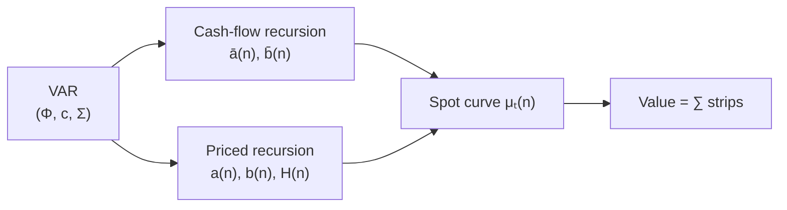

# The two recursions

## Where this sits on the map

1. Value is $E[\text{product}]$.
2. The product carries a covariance term.
3. One VAR supplies the joint law.

Given that VAR

$$
X_{t+1} = c + \Phi X_t + u_{t+1},
\qquad
u \sim N(0,\Sigma),
$$

and a one-period expected return

$$
\mu_t = \alpha + \xi'X_t + X_t'\Lambda X_t,
$$

Ang and Liu (2004) evaluate the product in closed form. Two recursions; the spot curve $\mu_t(n)$ is built from their ratio. The covariance estimated in $\Phi$ and $\Sigma$ enters **both**.



---

## 1. Cash-flow recursion

### Goal

Compute the expected cash-flow ratio $E_t[C_{t+n}]/C_t$ as a function of today’s state $X_t$.

### Setup

Let $e_g$ be the **selector vector** that picks the growth coordinate: $g_t = e_g'X_t$ (a vector of zeros with a one in the growth position). Cumulated growth is a sum of future $g$’s. Under the VAR, that sum is conditionally normal, so

$$
\frac{E_t[C_{t+n}]}{C_t}
  = \exp\!\bigl(\bar a(n) + \bar b(n)'X_t\bigr).
$$

Here $\bar a(n)$ is a scalar that depends only on maturity, and $\bar b(n)$ is a vector of the same length as $X_t$.

### First step ($n=1$)

For the next period,

$$
\bar a(1) = e_g'c + \tfrac12 e_g'\Sigma e_g,
\qquad
\bar b(1) = \Phi'e_g.
$$

- $e_g'c$ is the mean contribution of the intercept to next-period growth.
- $\tfrac12 e_g'\Sigma e_g$ is half the variance of the growth shock. It appears because $E[e^{u}] = e^{\tfrac12\mathrm{Var}(u)}$ for a normal shock $u$ (the same identity used on the previous pages).
- $\Phi'e_g$ maps today’s whole state into expected next-period growth.

### Step from $n$ to $n+1$

$$
\begin{aligned}
\bar a(n+1)
  &= \bar a(n) + e_g'c + \bar b(n)'c
   + \tfrac12(e_g+\bar b(n))'\Sigma(e_g+\bar b(n)), \\
\bar b(n+1)
  &= \Phi'(e_g + \bar b(n)).
\end{aligned}
$$

**In plain English:** $\bar a$ accumulates mean growth plus the variance adjustment from shocks; $\bar b$ accumulates how today’s state maps into future growth through $\Phi$. No discounting enters here, so there is no quadratic matrix yet.

```python
cf = model.cashflow_expectation(X, n=30)
```

**Offline numbers (seed 7):**

| $n$ | 1 | 5 | 10 | 15 |
|---:|---:|---:|---:|---:|
| $E_t[C_{t+n}]/C_t$ | 0.999 | 1.008 | 1.021 | 1.034 |


---

## 2. Priced recursion

### Goal

Compute one strip of the price–cash-flow ratio: the contribution of horizon $n$ to $V_t/C_t$. That strip is

$$
E_t\!\left[\exp\!\Bigl(\sum_{i=1}^{n}(g_{t+i}-\mu_{t+i})\Bigr)\right].
$$

### Functional form

Under the VAR and the quadratic map $\mu_t = \alpha + \xi'X_t + X_t'\Lambda X_t$, the strip takes the form

$$
\exp\!\bigl(a(n) + b(n)'X_t + X_t'H(n)X_t\bigr).
$$

- $a(n)$ = scalar (maturity-only)
- $b(n)$ = vector (linear loading on today’s state)
- $H(n)$ = matrix (quadratic loading on today’s state)

$H(n)$ appears because $\mu_t$ is quadratic whenever both beta and the premium move. When $\Lambda=0$, one has $H(n)\equiv 0$ and the strip is exponential-affine (exponential of a linear function of $X_t$).

### First step ($n=1$)

$$
a(1) = -\alpha + e_g'c + \tfrac12 e_g'\Sigma e_g,
\qquad
b(1) = -\xi + \Phi'e_g,
\qquad
H(1) = -\Lambda.
$$

Compared with the cash-flow recursion, the new pieces are $-\alpha$, $-\xi$, and $-\Lambda$: they subtract the expected-return side of the product.

### Further steps

The update from $n$ to $n+1$ is a recursive matrix formula (Ang and Liu, Proposition I.1). You do not need to expand it by hand: the package evaluates it. What matters for intuition is that $\Phi$ and $\Sigma$ enter the update, so the $-2\,\mathrm{Cov}(\sum g,\sum \mu)$ term from the mental map is **already folded into** $(a,b,H)$. You never compute the covariance separately; the recursion carries it automatically.

---

## 3. Spot discount rates $\mu_t(n)$

### Definition

Define the **spot rate** $\mu_t(n)$ so that dividing expected cash by $\exp(n\,\mu_t(n))$ recovers the priced strip:

$$
\frac{E_t[C_{t+n}]/C_t}{\exp\!\bigl(n\,\mu_t(n)\bigr)}
  = \text{priced strip at horizon }n.
$$

Taking logs and dividing by $n$ gives

$$
\mu_t(n) = A(n) + B(n)'X_t + X_t'G(n)X_t,
$$

where $A,B,G$ are the cash-flow coefficients minus the priced coefficients, scaled by $1/n$ (Ang and Liu, Definition II.1). Under stationarity (spectral radius of $\Phi$ less than 1), $\mu_t(n)$ converges to a constant long-run rate as $n\to\infty$.

```python
spots = model.spot_rates(X, n=30)   # μ_t(1), …, μ_t(30)
```

**Offline numbers (seed 7):**

| $n$ | 1 | 5 | 10 | 15 |
|---:|---:|---:|---:|---:|
| $\mu_t(n)$ (%) | 2.37 | 3.78 | 4.09 | 4.19 |

The curve rises from 2.4 % at $n=1$ toward roughly 4.2 % at long horizons. Locking the discount rate at $\mu_t(1)$ would misprice every longer strip — on this state the 15-year unit annuity is **+12.8 %** higher under the flat rate (see the discount-factor figure on [The problem](problem.md)).

!!! note "The practical bridge"
    Forecast cash however you like; discount at $\mu_t(n)$. Each spot already contains the covariance correction. The two-step workflow survives; only the single constant rate is replaced by a curve.

---

## 4. Present value = sum of strips

$$
\frac{V_t}{C_t}
  = \sum_{n=1}^{N}
      \frac{E_t[C_{t+n}]/C_t}{\exp\!\bigl(n\,\mu_t(n)\bigr)}
  + \text{tail at }\mu_t(N).
$$

Numerator and denominator share $(\Phi,c,\Sigma)$. The covariance is estimated once and enters both sides.

```python
V = model.value(X, C0)   # sum of strips + tail
```

On the same synthetic state: **value = 24.07**. A flat rate locked at $\mu_t(1)$ produces a 15-year present value about **13 % higher**.

The **tail** is a geometric remainder at the terminal spot $\mu_t(N)$, not a hand-set Gordon pair $(r,g)$.

| Call | Numerator | Denominator |
|---|---|---|
| `cashflow_expectation(X, n)` | cash-flow recursion | — |
| `spot_rates(X, n)` | — | $\mu_t(1),\ldots,\mu_t(n)$ |
| **`value(X, C)`** | both | both |
| external cash path | your forecast | `spot_rates` |

---

## 5. Gordon is a special case

If expected return and expected growth are both constant, then $b(n)=0$, $H(n)=0$, $a(n)=n(g-\mu)$, and

$$
\frac{V_t}{C_t}
  = \sum_{n} e^{n(g-\mu)}
  \;\approx\; \frac{1+g}{\mu-g}.
$$

That is Ang and Liu’s special case 1 — zero contribution from the covariance term, because there is no variation left to covary. The general case requires eigenvalues of $\Phi$ inside the unit circle and a declining priced strip.

---

## Side by side

| | Flat CAPM / WACC | Ang–Liu |
|---|---|---|
| Identity | ratio of expectations | $E[\text{product}]$ |
| Covariance | set to zero | inside $\Phi,\Sigma$, in both recursions |
| Discount rate | one $r$, all horizons | $\mu_t(n)$ from the joint system |
| Terminal value | hand-set Gordon | tail of the priced recursion |

---

## After this page

You should be able to:

1. Write the cash-flow recursion $\bar a(n),\bar b(n)$ and say what each term does on the first step.
2. Recognise that the priced recursion $(a,b,H)$ already contains the covariance correction.
3. Define the spot curve $\mu_t(n)$ as the rate that makes “expected cash / discount factor” recover the priced strip.
