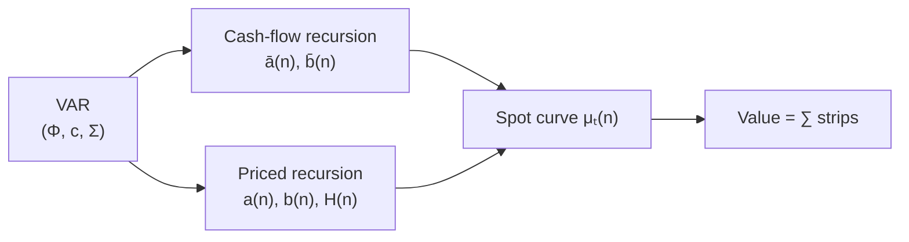

# The two recursions

Value is $E[\text{product}]$. The product carries a covariance term. One VAR supplies the joint law. Given that VAR

$$
X_{t+1} = c + \Phi X_t + u_{t+1},
\qquad
u \sim N(0,\Sigma),
$$

and a one-period expected return

$$
\mu_t = \alpha + \xi'X_t + X_t'\Lambda X_t,
$$

the product is evaluated in closed form. Two recursions do the work. The spot curve $\mu_t(n)$ is built from their ratio. The covariance estimated in $\Phi$ and $\Sigma$ enters *both*.



Everything below continues from [One system](system.md), on the same synthetic state (seed 7).

```python
from varvaluation import ExpectedReturnSpec, ValuationModel, estimate_var
from varvaluation.news import simulate_return_var

df, spec = simulate_return_var(nobs=400, seed=7)
fit = estimate_var(df, spec)
xi, Lambda = ExpectedReturnSpec(rate="ret", beta="g", premium=()).xi_lambda(
    spec, {"b0": 0.01}
)
model = ValuationModel.from_var(fit, xi=xi, Lambda=Lambda, alpha=0.04)
X = fit.X_lag[-1]
```

---

## The cash-flow recursion

The first object is the expected cash-flow ratio $E_t[C_{t+n}]/C_t$, as a function of today’s state $X_t$.

Let $e_g$ be the *selector vector* that picks the growth coordinate: $g_t = e_g'X_t$, a vector of zeros with a one in the growth position. Cumulated growth is a sum of future $g$’s. Under the VAR that sum is conditionally normal, so

$$
\frac{E_t[C_{t+n}]}{C_t}
  = \exp\!\bigl(\bar a(n) + \bar b(n)'X_t\bigr).
$$

$\bar a(n)$ is a scalar that depends only on maturity. $\bar b(n)$ is a vector of the same length as $X_t$.

For the next period,

$$
\bar a(1) = e_g'c + \tfrac12 e_g'\Sigma e_g,
\qquad
\bar b(1) = \Phi'e_g.
$$

$e_g'c$ is the mean contribution of the intercept to next-period growth. $\tfrac12 e_g'\Sigma e_g$ is half the variance of the growth shock. It appears because $E[e^{u}] = e^{\tfrac12\mathrm{Var}(u)}$ for a normal shock $u$ — the same identity used on the previous pages. $\Phi'e_g$ maps today’s whole state into expected next-period growth.

The step from $n$ to $n+1$ is

$$
\begin{aligned}
\bar a(n+1)
  &= \bar a(n) + e_g'c + \bar b(n)'c
   + \tfrac12(e_g+\bar b(n))'\Sigma(e_g+\bar b(n)), \\
\bar b(n+1)
  &= \Phi'(e_g + \bar b(n)).
\end{aligned}
$$

In words: $\bar a$ accumulates mean growth plus the variance adjustment from shocks; $\bar b$ accumulates how today’s state maps into future growth through $\Phi$. No discounting enters here, so there is no quadratic matrix yet.

```python
cf = model.cashflow_expectation(X, n=15)
for n in (1, 5, 10, 15):
    print(f"n={n:2d}  E[C]/C = {cf[n-1]:.3f}")
```

```text
n= 1  E[C]/C = 0.999
n= 5  E[C]/C = 1.008
n=10  E[C]/C = 1.021
n=15  E[C]/C = 1.034
```


---

## The priced recursion

The second object is one strip of the price–cash-flow ratio: the contribution of horizon $n$ to $V_t/C_t$. That strip is

$$
E_t\!\left[\exp\!\Bigl(\sum_{i=1}^{n}(g_{t+i}-\mu_{t+i})\Bigr)\right].
$$

Under the VAR and the quadratic map $\mu_t = \alpha + \xi'X_t + X_t'\Lambda X_t$, the strip takes the form

$$
\exp\!\bigl(a(n) + b(n)'X_t + X_t'H(n)X_t\bigr).
$$

$a(n)$ is a scalar that depends only on maturity. $b(n)$ is the linear loading on today’s state. $H(n)$ is the quadratic loading. $H(n)$ appears because $\mu_t$ is quadratic whenever both beta and the premium move. When $\Lambda=0$, one has $H(n)\equiv 0$ and the strip is exponential-affine — the exponential of a linear function of $X_t$.

For the next period,

$$
a(1) = -\alpha + e_g'c + \tfrac12 e_g'\Sigma e_g,
\qquad
b(1) = -\xi + \Phi'e_g,
\qquad
H(1) = -\Lambda.
$$

Compared with the cash-flow recursion, the new pieces are $-\alpha$, $-\xi$, and $-\Lambda$. They subtract the expected-return side of the product.

The update from $n$ to $n+1$ is a recursive matrix formula (see [Ang and Liu, 2004](../references.md#ang-liu-2004), Proposition I.1). You do not need to expand it by hand: the package evaluates it inside `spot_rates` and `value`. What matters for intuition is that $\Phi$ and $\Sigma$ enter the update, so the $-2\,\mathrm{Cov}(\sum g,\sum \mu)$ term from the first page is *already folded into* $(a,b,H)$. You never compute the covariance separately. The recursion carries it automatically.

---

## Spot discount rates $\mu_t(n)$

Define the *spot rate* $\mu_t(n)$ so that dividing expected cash by $\exp(n\,\mu_t(n))$ recovers the priced strip:

$$
\frac{E_t[C_{t+n}]/C_t}{\exp\!\bigl(n\,\mu_t(n)\bigr)}
  = \text{priced strip at horizon }n.
$$

Taking logs and dividing by $n$ gives

$$
\mu_t(n) = A(n) + B(n)'X_t + X_t'G(n)X_t,
$$

where $A$, $B$, and $G$ are the cash-flow coefficients minus the priced coefficients, scaled by $1/n$ (see [Ang and Liu, 2004](../references.md#ang-liu-2004), Definition II.1). Under stationarity — spectral radius of $\Phi$ less than one — $\mu_t(n)$ converges to a constant long-run rate as $n\to\infty$.

```python
spots = model.spot_rates(X, n=15)

# identity: the one-period spot must match μ_t = α + ξ'X + X'ΛX
mu_t = float(0.04 + xi @ X + X @ Lambda @ X)
print(f"μ_t(1)        = {100 * spots[0]:.4f}%")
print(f"α + ξ'X + …   = {100 * mu_t:.4f}%")

for n in (1, 5, 10, 15):
    print(f"n={n:2d}  μ_t(n) = {100 * spots[n-1]:.2f}%")
```

```text
μ_t(1)        = 2.3709%
α + ξ'X + …   = 2.3709%
n= 1  μ_t(n) = 2.37%
n= 5  μ_t(n) = 3.78%
n=10  μ_t(n) = 4.09%
n=15  μ_t(n) = 4.19%
```

The curve rises from 2.4% at $n=1$ toward roughly 4.2% at long horizons. Locking the discount rate at $\mu_t(1)$ would misprice every longer strip. On this state the 15-year unit annuity is *12.8% higher* under the flat rate (see [The problem](problem.md)).

That is the practical bridge. Forecast cash however you like; discount at $\mu_t(n)$. Each spot already contains the covariance correction. The two-step workflow survives. Only the single constant rate is replaced by a curve.

---

## Present value is the sum of strips

$$
\frac{V_t}{C_t}
  = \sum_{n=1}^{N}
      \frac{E_t[C_{t+n}]/C_t}{\exp\!\bigl(n\,\mu_t(n)\bigr)}
  + \text{tail at }\mu_t(N).
$$

Numerator and denominator share $(\Phi,c,\Sigma)$. The covariance is estimated once and enters both sides. The *tail* is a geometric remainder at the terminal spot $\mu_t(N)$, not a hand-set Gordon pair $(r,g)$.

```python
import numpy as np

V = model.value(X, C=1.0, n=40)
print(f"strip-sum value = {V:.2f}")

n = 15
rates = model.spot_rates(X, n=n)
mat = np.arange(1, n + 1)
curve_pv = float(np.exp(-mat * rates).sum())
flat_pv  = float(np.exp(-mat * rates[0]).sum())
print(f"15y unit annuity, curve = {curve_pv:.4f}")
print(f"15y unit annuity, flat  = {flat_pv:.4f}")
print(f"flat vs curve           = {100 * (flat_pv / curve_pv - 1):+.1f}%")
```

```text
strip-sum value = 24.07
15y unit annuity, curve = 11.0631
15y unit annuity, flat  = 12.4737
flat vs curve           = +12.8%
```

`cashflow_expectation(X, n)` returns the numerator. `spot_rates(X, n)` returns the curve $\mu_t(1),\ldots,\mu_t(n)$. `value(X, C)` uses both. If you bring your own cash path, discount it at `spot_rates`. The end-to-end offline script that prints the same path is

```text
python examples/quickstart.py
```

---

## Gordon is a special case

If expected return and expected growth are both constant, then $b(n)=0$, $H(n)=0$, $a(n)=n(g-\mu)$, and

$$
\frac{V_t}{C_t}
  = \sum_{n} e^{n(g-\mu)}
  \;\approx\; \frac{1+g}{\mu-g}.
$$

That is the constant-rate special case — zero contribution from the covariance term, because there is no variation left to covary. The general case requires eigenvalues of $\Phi$ inside the unit circle and a declining priced strip.

A flat CAPM or WACC replaces the product by a ratio of expectations, sets the covariance to zero, uses one $r$ at every horizon, and finishes with a hand-set Gordon tail. The joint VAR keeps the product, carries the covariance inside $\Phi$ and $\Sigma$, discounts at $\mu_t(n)$, and finishes with the tail of the priced recursion. Those are not two implementations of the same formula. They are two different formulas.
