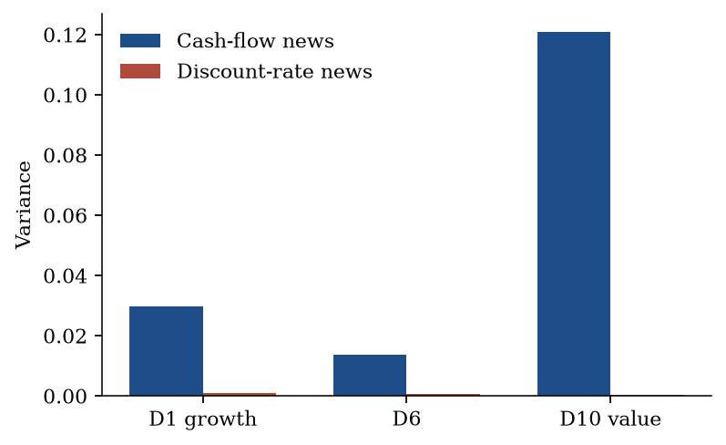

# News

[Valuation](valuation.md) asks: *what is it worth at $X_t$?* News asks a
different question from the **same** VAR: *what moved last period’s
unexpected return?*

Campbell (1991) writes the unexpected return as cash-flow news minus
discount-rate news,

$$
r_{t+1} - \mathbb{E}_t r_{t+1}
  = N_{\mathrm{CF},t+1} - N_{\mathrm{DR},t+1}.
$$

$N_{\mathrm{DR}}$ is the revision in expected **future** returns.
$N_{\mathrm{CF}}$ is the revision in expected **future** cash flows (plus
the current cash-flow surprise).

## The residual trap

The usual implementation estimates $N_{\mathrm{DR}}$ from the VAR and
**defines** cash-flow news as whatever is left:

$$
N_{\mathrm{CF}}^{\text{resid}}
  = (r_{t+1}-\mathbb{E}_t r_{t+1}) + N_{\mathrm{DR}}.
$$

Chen, Da, Zhao (2013) point out that this residual absorbs every
misspecification of the discount-rate model. Their Treasury test makes it
concrete: coupon payments are known, so there is no cash-flow news, and
the VAR still finds some — because $N_{\mathrm{DR}}$ is imperfect, and
the leftover is labelled “cash flow.”

This library never uses the residual as the definition of cash-flow news.

## Direct cash-flow news

Let $u_{t+1}$ be the VAR residual at the estimation horizon, $e_{\mathrm{cf}}$
the unit vector for `spec.cashflow`, and $\rho\in(0,1)$ the Campbell–Shiller
linearization parameter (default $0.96$).

$$
N_{\mathrm{DR},t+1}
  = \lambda'\,\rho\Phi(I-\rho\Phi)^{-1}u_{t+1}
$$

$$
N_{\mathrm{CF},t+1}^{\mathrm{direct}}
  = e_{\mathrm{cf}}'(I-\rho\Phi)^{-1}u_{t+1}
$$

The second line is a revision in the **cash-flow equation**, the same row
that feeds $\bar b(n)$ on the [valuation](valuation.md) page. Mutating the
return residual does not change `news.frame["cf"]`. That is the Chen
invariant, and it is tested.

$\lambda$ is chosen in exactly one of two ways:

1. **Expected-return gradient** (when the VAR has no return
   equation). Pass `xi` and `Lambda`. Then
   $\lambda = \xi + 2\Lambda\bar X$ with $\bar X$ the unconditional mean.
   A typical state `(g, beta, dpo, r, cay, pi)` contains no equity return.
   Discount-rate news is the revision in
   $\mu_t = \alpha + \xi'X + X'\Lambda X$, linearized.
2. **Named return equation** (Campbell–Shiller). Pass `return_state` as a
   name in `spec.names`. Then $\lambda = e_{\mathrm{return}}$. Use this
   when the VAR itself contains the return, as in the textbook
   $(r, \Delta d, dp)$ system.

Passing both, or neither, raises `StateSpecError`.

```python
news = news_decomposition(fit, returns, xi=xi, Lambda=Lambda)
# news.frame: date, cf, dr, unexpected, residual
# news.shares: var_cf, var_dr, cov, var_unexpected, residual_share
```

`residual = unexpected - (cf - dr)` is **always** present. It is a
diagnostic of how well the identity closes, not a third kind of news. A
large residual share means the unexpected-return series you passed is not
the object this VAR prices — typical when the VAR has no return equation
and you hand in market returns.


<p class="figure-caption">Variance of <em>direct</em> cash-flow news versus discount-rate news. CF news is the $g$ equation, not the residual. Value (D10) is CF-dominated. DR news is small once $\lambda$ is the expected-return gradient rather than a return equation inside the VAR.</p>

The returns frame must be **simple** returns in $(-1, 5)$. Use compounded
twelve-month simple returns, $\exp(\sum \log(1+r))-1$, not a raw sum of
logs (that sum can fall below $-1$ and fail the schema).

## Treasury test

```python
from varvaluation import treasury_test

news = treasury_test(nobs=800)
assert news.shares.var_cf < 1e-6
```

On a synthetic series whose cash-flow equation is identically zero, direct
CF news is approximately 0. Whatever the discount-rate model missed sits
in `residual`. That is Chen, Da, Zhao’s check, implemented as a test
helper with no data dependency.

!!! note "Valuation versus news"
    Isolation (`isolate_channels`) shuts a loading and **revalues**.
    News decomposes last period’s **return surprise**. Same VAR, different
    question. Do not mix the two tables.
