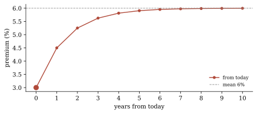
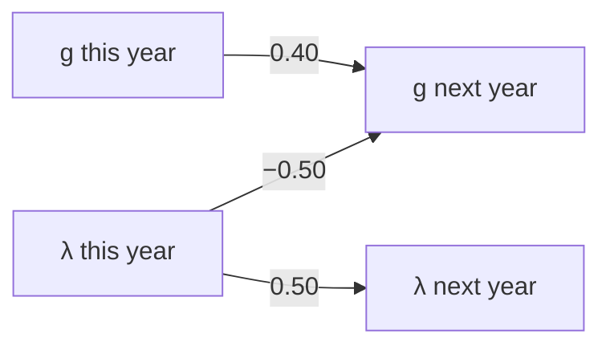
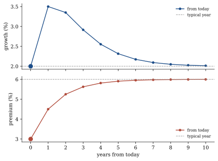
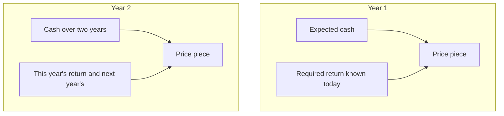
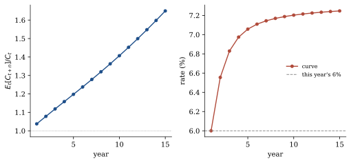
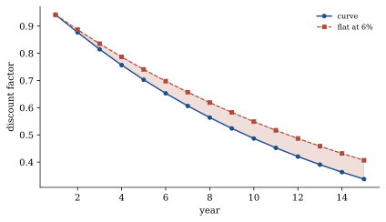
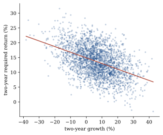
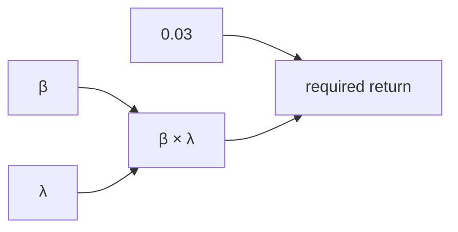

# A numerical walkthrough

The six-variable state in [Ang and Liu (2004)](angliu.md) is too large to compute by hand. Below is the same machinery on a smaller claim. The numbers are made up. Nothing is estimated from returns.

```text
uv run python examples/numerical_toy.py
```

---

## A simple claim

You are valuing a claim that pays cash once a year. Two numbers describe it: how fast the cash is growing, \(g_t\), and the equity premium, \(\lambda_t\). The risk-free rate is 3% and does not move. Beta is 1, so the return you require this year is just the risk-free rate plus the premium,

$$
\mu_t = 0.03 + \lambda_t.
$$

In a typical year growth is 2% and the premium is 6%. Today growth is still 2%, but the premium is 3%.

---

## One series: an AR

Watch only the premium. Next year is a constant plus a fraction of this year, plus a shock:

$$
\lambda_{t+1} = 0.03 + 0.50\,\lambda_t + \text{shock}.
$$

That is an autoregression (AR). The 0.50 is stickiness: half of this year’s premium carries into next year. When \(\lambda=6\%\), next year is also 6% (before the shock). That 6% is the mean. Today you are at 3%, so next year is \(0.03 + 0.50\times 0.03 = 4.5\%\).

```python
import numpy as np

lam = 0.03
path_lam = [lam]
for _ in range(10):
    path_lam.append(0.03 + 0.50 * path_lam[-1])
# year 0: 3.00%   today
# year 1: 4.50%
# year 2: 5.25%
# year 10: 6.00%   the mean
```

Plot it. The dashed line is the mean. The dots walk toward it. That is mean reversion for one series.

```python
import matplotlib.pyplot as plt

years = np.arange(len(path_lam))
plt.plot(years, 100 * np.array(path_lam), "o-")
plt.axhline(6.0, ls="--")
plt.xlabel("years from today")
```


<p class="figure-caption">The premium alone. Each dot is <code>0.03 + 0.50 ×</code> last year’s premium.</p>

---

## The world: a VAR

Growth has a next year too, and it depends on the premium. The state of the world is the pair \(X_t = (g_t,\lambda_t)\). Two ARs that share lags: a VAR.

The second equation is the AR you just ran. The first is new: next year’s growth also sees this year’s premium.

```python
Phi = np.array([
    [ 0.40, -0.50],   # g next year
    [ 0.00,  0.50],   # λ next year  (the AR)
])
X_bar = np.array([0.02, 0.06])
c     = (np.eye(2) - Phi) @ X_bar
X     = np.array([0.02, 0.03])
```



Same loop, now on the vector:

```python
path = [X]
for _ in range(10):
    path.append(c + Phi @ path[-1])
path = np.array(path)
```

`path[:, 1]` is the AR (3, 4.5, …, 6). `path[:, 0]` is growth: it rises to 3.5% because the premium is cheap (−0.50), then fades back to 2% as \(\lambda\) returns to 6%.

```python
years = np.arange(len(path))
fig, axes = plt.subplots(2, 1, sharex=True)
axes[0].plot(years, 100 * path[:, 0], "o-")
axes[0].axhline(2.0, ls="--")
axes[1].plot(years, 100 * path[:, 1], "o-")
axes[1].axhline(6.0, ls="--")
```


<p class="figure-caption">Bottom: the AR. Top: growth, which moves because \(\lambda\) does.</p>

---

## Next year's cash

The shocks and the rest of the arrays, used from here on:

```python
Sigma = np.array([
    [ 0.0040, -0.0010],
    [-0.0010,  0.0025],
])
alpha = 0.03
xi    = np.array([0.0, 1.0])
Lambda = np.zeros((2, 2))
e_g   = np.array([1.0, 0.0])
```

Next year’s cash is this year’s cash, grown by \(g_{t+1}\). You do not know \(g_{t+1}\) yet, but today’s pair gives you its expectation. Because growth is a log and the shock is normal, the expectation of the exponential also picks up a variance term.

```python
bar_a1 = e_g @ c + 0.5 * e_g @ Sigma @ e_g
bar_b1 = Phi.T @ e_g
cf1 = np.exp(bar_a1 + bar_b1 @ X)      # 1.0377
```

Expected cash next year is 3.77% above today. The same number from the map: expected growth is 3.5%, then add Jensen.

```python
E_g = e_g @ (c + Phi @ X)              # 0.035
np.exp(E_g + 0.5 * Sigma[0, 0])        # 1.0377
```

Today’s premium is low, so expected growth is a little above the 2% typical year. That is the −0.50 in \(\Phi\).

---

## This year's discount

You require 6% this year, and you already know that. The year-1 piece of the price is next year’s expected cash, discounted at 6%.

```python
a1 = -alpha + e_g @ c + 0.5 * e_g @ Sigma @ e_g    # 0.014
b1 = -xi + Phi.T @ e_g                             # (0.40, -1.50)
H1 = -Lambda                                       # 0
strip1 = np.exp(a1 + b1 @ X)                       # 0.9773
```

That is the same as multiplying the cash ratio by \(e^{-0.06}\):

```python
np.exp(-(alpha + X[1])) * cf1          # 0.9773
```

Next year’s required return is not in this number. It is not known yet.

---

## The one-year rate

The one-year rate is the number that turns expected cash into that price piece.

```python
mu1 = (bar_a1 - a1) + (bar_b1 - b1) @ X    # 0.0600
alpha + X[1]                               # 0.0600
```

It is 6%, which is just \(\mu_t\). If this failed, the two steps were started inconsistently.

---

## Two years

Year 2 is different. You discount through this year *and* next year. Next year’s required return depends on next year’s premium, which you do not know today. Cash and the discount both move.



```python
eb = e_g + bar_b1
bar_a2 = bar_a1 + e_g @ c + bar_b1 @ c + 0.5 * eb @ Sigma @ eb
bar_b2 = Phi.T @ eb
cf2 = np.exp(bar_a2 + bar_b2 @ X)          # 1.0784

D = e_g + b1
a2 = a1 - alpha + (e_g + b1) @ c + 0.5 * D @ Sigma @ D
b2 = -xi + Phi.T @ (e_g + b1)
strip2 = np.exp(a2 + b2 @ X)               # 0.9459
mu2 = (bar_a2 - a2) / 2 + (bar_b2 - b2) @ X / 2   # 0.06555
```

Expected cash two years out is 7.84% above today. The two-year rate is 6.555%. That is not the average of this year’s 6% and next year’s expected required return. The two paths move together, so the rate that prices the strip is not the expected path of \(\mu\).

---

## The curve

Keep walking the same two steps.

| Year | Rate | Expected cash | Price piece |
|---:|---:|---:|---:|
| 1 | 6.000% | 1.038 | 0.977 |
| 2 | 6.555% | 1.078 | 0.946 |
| 5 | 7.057% | 1.198 | 0.842 |
| 10 | 7.202% | 1.407 | 0.685 |

The curve slopes up. Today’s premium is 3%, and it will not stay there. A long cash flow is not priced at this year’s 6%.


<p class="figure-caption">Left: expected cash relative to today. Right: the rate that prices each year, against a flat 6%.</p>

A 15-year unit annuity on this curve is 8.89. The same annuity locked at 6% is 9.60. Using this year’s rate for every year overvalues the claim.


<p class="figure-caption">Each year’s contribution to a unit annuity. The shaded gap is the overvaluation from locking this year’s rate.</p>

---

## One VAR, not two forecasts

At two years you can draw the shocks and check. The joint object is cash times the discount path. The formula already has it (0.9459). Averaging the two pieces separately and multiplying gives 0.9436. The gap is the covariance: a high premium comes with low growth.

```python
rng = np.random.default_rng(0)
N = 200_000
L = np.linalg.cholesky(Sigma)
U1 = L @ rng.standard_normal((2, N))
U2 = L @ rng.standard_normal((2, N))
X1 = c[:, None] + Phi @ X[:, None] + U1
X2 = c[:, None] + Phi @ X1 + U2

product   = np.exp(-(alpha + X[1]) - (alpha + X1[1]) + X1[0] + X2[0])
cf_path   = np.exp(X1[0] + X2[0])
disc_path = np.exp(-(alpha + X[1]) - (alpha + X1[1]))
# product.mean() ≈ 0.9461  (closed form 0.9459)
# disc_path.mean() * cf_path.mean() ≈ 0.9436
```

The draws are a check. Once the shocks are Gaussian, the closed form *is* the joint expectation.


<p class="figure-caption">Draws of the two-year paths. High required return comes with low growth.</p>

---

## When beta moves too

So far beta is 1. Now let it be 1.2, and let it move. The return you require is a product of two moving pieces.



```python
# X = (g, β, λ)
Lambda = np.zeros((3, 3))
Lambda[1, 2] = Lambda[2, 1] = 0.5      # X'ΛX = βλ
xi = np.zeros(3)
X  = np.array([0.02, 1.20, 0.03])
# μ_t = 0.03 + 1.20 × 0.03 = 0.066
```

The year-1 price piece now has an extra matrix, because the exponent contains that product. Call it \(H\). At one year you just subtract today’s \(\beta\lambda\), so \(H(1)=-\Lambda\) and \(X'H(1)X=-0.036\). The one-year rate is still 6.60%, which is \(0.03+\beta_t\lambda_t\).

At two years, tomorrow’s \(\beta\lambda\) depends on today through \(\Phi\), so \(H(2)\) is no longer \(-\Lambda\). When beta was fixed, \(\Lambda\) was zero and \(H\) stayed zero. That was the first claim.

---

## The same numbers from the library

Back on the first claim (beta fixed at 1):

```python
from varvaluation import StateSpec, ValuationModel

xi = np.array([0.0, 1.0])
Lambda = np.zeros((2, 2))
X = np.array([0.02, 0.03])

spec  = StateSpec(names=("g", "lam"), cashflow="g")
model = ValuationModel(spec, Phi, c, Sigma, xi, Lambda, alpha)
rates = model.spot_rates(X, n=15)
value = model.value(X, C=1.0, n=40)    # 22.38
```

`spot_rates` is the curve in the table. The numpy above *is* that call. The six-variable curve on [Ang and Liu (2004)](angliu.md) is the same objects with more rows.
