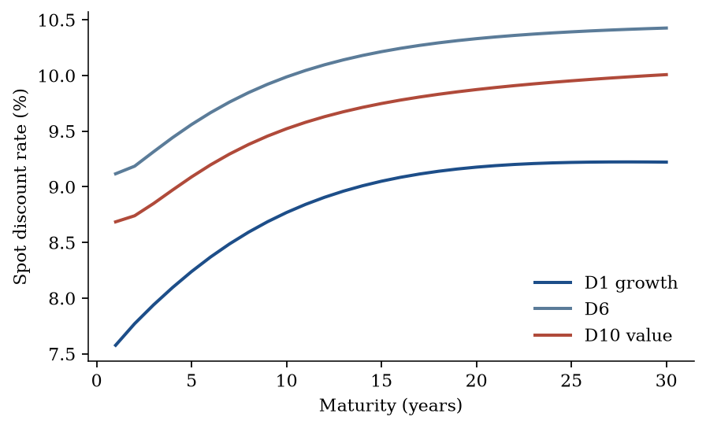
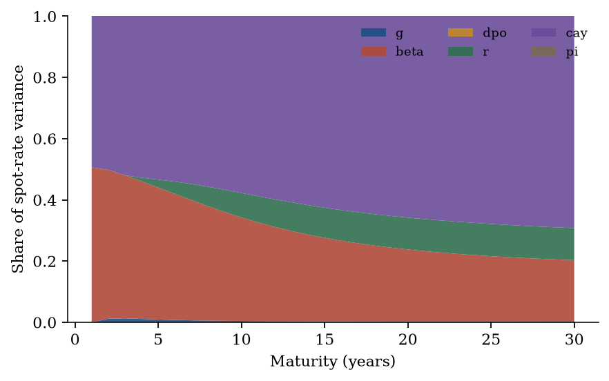

# What changes

The textbook DCF and this system answer the same question — what is a
claim to future cash flows worth today — with different objects.

## Side by side

|  | Textbook DCF | This system |
|---|---|---|
| Discount rate | One WACC, all horizons | A curve $\mu_t(n)$ that mean-reverts with $X_t$ |
| Cash flows | A point-forecast path you typed in | $\mathbb{E}_t[C_{t+n}]/C_t$ from the $g$ equation, mean *and* variance |
| $g$–$\mu$ interaction | None | $-2\,\mathrm{Cov}_t(\sum g,\sum\mu)$ sits inside the price |
| Uncertainty | Folded into a risk premium by hand | $\tfrac12\mathrm{Var}_t[S_n]$, signed by convexity |
| Terminal value | Gordon, a separate hand-set $(r,g)$ | The tail of the same recursion |
| Beta | A single number | A state, so loadings $b(n)$, $H(n)$ vary with horizon |
| Price | An input you sanity-check against | An output of $(\Phi,c,\Sigma,\xi,\Lambda)$ |

## Three things that concretely change

### 1. The discount curve tilts

If expected returns sit above their long-run mean and mean-revert, then
$\mu_t(10)$ is already close to the unconditional mean while $\mu_t(1)$
is high. A flat WACC at *today’s* high rate discounts every horizon too
hard and **undervalues**. The reverse, a flat WACC at today’s *low*
rate, overvalues the long strip.

A different mistake is just as common: a historical-average WACC on a
date when the fitted curve sits *below* that average (a low-premium
state). The flat rate is then too high at the short end, so the
constant-rate DCF **undervalues**. Signed error
$(\text{wrong}-\text{correct})/\text{correct}$ is negative when the
wrong model produces the smaller present value. The error scales with
duration — worst exactly for the growth names where a DCF is already
most fragile.

Term structure of $\mu_t(n)$ for growth (D1), mid (D6), and value (D10) at the last state in the 1965–2024 sample. A single WACC is a flat line through this picture.

### 2. Cash-flow forecasts get a distribution, not a path

A “conservative case” in a spreadsheet is an informal substitute for
the $\tfrac12\mathrm{Var}$ term. Here the correction is analytic, and
its *direction* depends on the sign of $\mathrm{Cov}(\sum g,\sum\mu)$,
which no scenario table gives you. See [The VAR](system.md#where-the-joint-distribution-enters-the-price).

### 3. Duration and risk become the same object

Because $b(n)$ and $H(n)$ vary with horizon, the sensitivity of value
to the state differs across the cash-flow strip. That is the object
dividend-strip markets later made observable. Isolation
(`isolate_channels`) asks the counterfactual version of the same
question: shut a named state on one side and revalue.

## What the fitted curve looks like

On Ken French book-to-market deciles the short end of $\mu_t(n)$ moves
with the premium; the long end is pulled back by mean reversion. When
the premium is unusually low, the curve slopes **up** and sits below a
historical-average WACC. A DCF that used that WACC at such a date was
discounting every horizon too hard.

A variance decomposition of $\mu_t(n)$ (not of returns) typically
gives the short rate and $\mathit{cay}$ most of the discount-curve
variation. $g$ is negligible *for the curve*. That does not mean cash
flows do not matter for prices — they drive the numerator, which this
decomposition does not show.

Share of spot-rate variance by state, value decile. $\mathit{cay}$ and $\beta$ dominate the curve. The numerator is a different object.

## Price-explaining, not price-watching

The alternative to this framework is guessing with structure: pick a
WACC from a table, pick a terminal growth rate, run three scenarios,
adjust by feel. Every claim about what drives the valuation is then
untestable, because nothing in the procedure pins down where a number
came from.

A joint VAR replaces each guess with a measured object.

- “Rates are low today so growth stocks should be worth more” becomes
  a computed curve $\mu_t(n)$ whose slope depends on estimated
  persistence.
- “Uncertainty is high so I add a premium” becomes the
  sign-disciplined $\tfrac12\mathrm{Var}$ and $-2\,\mathrm{Cov}$ terms.
- “This stock is riskier” becomes a $\beta_t$ series with measured
  volatility and persistence.

When the valuation is wrong, you can trace *which link* failed —
premium regression, beta dynamics, or the cash-flow process — instead
of re-arguing the whole model.

## The honest caveat

Everything hinges on $\hat\Phi$ and $\hat\Sigma$. The priced recursion
accumulates $\Phi^n$, so an overestimate of persistence compounds into
large errors at long horizons. Stambaugh bias guarantees you
overestimate persistence in short samples with persistent predictors.

You have traded transparent assumptions (a WACC you can argue about)
for statistical assumptions that are harder to interrogate and just as
consequential. Use the system to understand the **shape** of the
discount curve and the **sign** of the growth–rate interaction. Be
skeptical of the third decimal place.

Estimation risk does not shrink the errors — it compounds them.
Inspect `fit.spectral_radius` and the cash-flow own-lag before you
publish a present value. The checklist is on
[Estimation](estimate.md#what-can-go-wrong).
