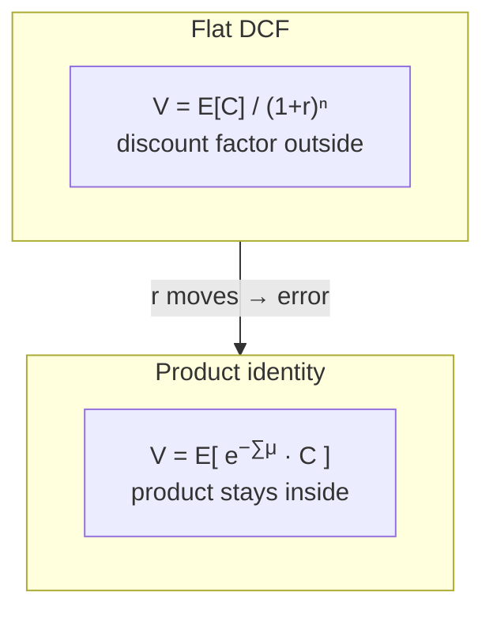
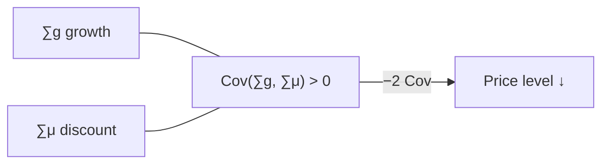

# The problem

## Where this sits on the map

1. **Product.** Asset pricing is an expectation of a product: cash flow times a path of discount factors.
2. **Covariance.** $E[XY] = E[X]E[Y] + \mathrm{Cov}(X,Y)$. That covariance term is part of the *price*, not a diagnostic computed afterwards.
3. **One system.** Cash-flow growth and expected returns must be modeled jointly — one VAR — or the covariance is missing by construction.

This page writes out claims 1 and 2, then shows the flat-versus-curve gap in numbers. Claim 3 is the next page.


---

## 1. Value is the expectation of a product

You already know the workhorse formula used in practice:

$$
V_t = \sum_{j=1}^{\infty} \frac{E_t[C_{t+j}]}{(1+r)^j}.
$$

- $V_t$ = value of the claim today
- $C_{t+j}$ = cash flow $j$ periods ahead
- $E_t[\cdot]$ = expectation given information at date $t$
- $r$ = one constant discount rate for every horizon

The factor $1/(1+r)^j$ has been taken **outside** the expectation. That is legitimate only if the discount rate is known in advance (deterministic).

Start instead from the definition of the **one-period expected return** $\mu_t$. Let $P_t$ be the ex-dividend price. Then

$$
e^{\mu_t}
  = E_t\!\left[\frac{P_{t+1}+C_{t+1}}{P_t}\right].
$$

$\mu_t$ is known today; future $\mu_{t+1},\mu_{t+2},\ldots$ are random. Iterating this definition forward gives the multi-period product identity ([Ang and Liu, 2004](../references.md#ang-liu-2004), eq. 2):

$$
V_t
  = \sum_{s=1}^{\infty}
    E_t\!\left[
      \exp\!\Bigl(-\sum_{k=0}^{s-1} \mu_{t+k}\Bigr)\,C_{t+s}
    \right].
$$

**In plain English:** the object inside the expectation is a **product** — a cash flow multiplied by a sequence of one-period discount factors $e^{-\mu}$. You cannot replace $E[\text{product}]$ by a ratio of two separate forecasts without an extra term.



!!! note "Punchline"
    The constant-rate formula replaces $E[\text{product}]$ by a ratio of expectations. Once expected returns move, that replacement is an error — not a second-order approximation.

---

## 2. The covariance term {#the-covariance-term}

### Step A — write cash flows in growth form

Define **cash-flow growth** as the log change

$$
g_{t+i} = \log\bigl(C_{t+i}/C_{t+i-1}\bigr).
$$

Then the cash flow $n$ periods ahead is

$$
C_{t+n} = C_t\,\exp\!\Bigl(\sum_{i=1}^{n} g_{t+i}\Bigr).
$$

### Step B — one strip of the price–cash-flow ratio

A **strip** is the contribution of a single horizon $n$ to the price–cash-flow ratio. Substituting the growth form into the product identity, that contribution is proportional to

$$
E_t\!\left[
  \exp\!\Bigl(\sum_{i=1}^{n}(g_{t+i}-\mu_{t+i})\Bigr)
\right].
$$

Call the sum inside the exponential

$$
S_n = \sum_{i=1}^{n}(g_{t+i}-\mu_{t+i}).
$$

So the strip is $E_t[e^{S_n}]$.

### Step C — expectation of an exponential of a normal sum

Assume the shocks that drive $g$ and $\mu$ are jointly normal (Gaussian). Then $S_n$, being a linear combination of those shocks, is also normal. For a normal random variable $S$,

$$
E[e^{S}] = \exp\!\Bigl( E[S] + \tfrac12\mathrm{Var}(S) \Bigr).
$$

Applied conditionally at date $t$:

$$
E_t[e^{S_n}]
  = \exp\!\Bigl(
      E_t[S_n] + \tfrac12\mathrm{Var}_t[S_n]
    \Bigr).
$$

### Step D — open the variance

Write $S_n = \sum g - \sum \mu$. The variance of a difference is

$$
\mathrm{Var}_t[S_n]
  = \mathrm{Var}_t\Bigl[\sum g\Bigr]
  + \mathrm{Var}_t\Bigl[\sum \mu\Bigr]
  - 2\,\mathrm{Cov}_t\Bigl[\sum g,\;\sum \mu\Bigr].
$$

Four pieces therefore enter the **level** of the price:

| Term | Effect on value |
|---|---|
| $E_t[\sum g]$ | point-forecast growth (the usual DCF part) |
| $\tfrac12\mathrm{Var}(\sum g)$ | growth uncertainty *raises* value (convexity of the exponential) |
| $\tfrac12\mathrm{Var}(\sum \mu)$ | discount-rate uncertainty *raises* value |
| $-2\,\mathrm{Cov}(\sum g,\sum \mu)$ | **the economically important one** |

If good news about growth arrives together with *higher* expected returns — the usual aggregate pattern — then $\mathrm{Cov}>0$, the $-2\,\mathrm{Cov}$ term is negative, and **value is lower** than any DCF that ignores the interaction.



!!! note "Punchline"
    The covariance is not a variance-decomposition detail. It shifts the level of the price. A model that forecasts cash and discount rates in separate drawers has already set it to zero.

---

## 3. One system, or the covariance is gone

If you forecast cash in one model and the required return in another:

1. The two forecasts need not share a horizon.
2. They can contradict each other.
3. There is nowhere for $\mathrm{Cov}(\sum g,\sum \mu)$ to live.

A **vector autoregression (VAR)** is a system of regressions in which every variable is explained by lags of every variable in the list. For a state vector $X_t$ that contains both cash-flow growth and the variables that move expected returns, one shock covariance matrix $\Sigma$ generates the joint surprises and one companion matrix $\Phi$ carries the cross-forecasts. That is the next page.

---

## What a flat rate gets wrong

Even given the right joint model, practice often collapses the curve to one number $\mu_t$ used at every maturity. Write $V_t(n)$ for the strip at horizon $n$. A **spot rate** $\mu_t(n)$ is defined by

$$
V_t(n)
  = \frac{E_t[C_{t+n}]}{\exp\bigl(n\,\mu_t(n)\bigr)}.
$$

In words: $\mu_t(n)$ is the constant rate that, applied over $n$ periods, recovers the correct strip value from expected cash alone. A **flat** rule sets $\mu_t(n)=\mu_t(1)$ for all $n$. The curve is not flat: at short horizons the market risk premium dominates; at long horizons mean reversion in rates and betas matters. Using a constant rate produces large misvaluations.

Mean reversion in the expected return already produces a non-flat curve:


### Follow along — the flat-versus-curve gap

The same synthetic state (seed 7) is used on every page of this course. Build a model, read the spot curve, and compare a 15-year unit annuity under the curve versus under the flat rate $\mu_t(1)$:

```python
import numpy as np
from varvaluation import ExpectedReturnSpec, ValuationModel, estimate_var
from varvaluation.news import simulate_return_var

df, spec = simulate_return_var(nobs=400, seed=7)
fit = estimate_var(df, spec)
xi, Lambda = ExpectedReturnSpec(rate="ret", beta="g", premium=()).xi_lambda(
    spec, {"b0": 0.01}
)
model = ValuationModel.from_var(fit, xi=xi, Lambda=Lambda, alpha=0.04)
X = fit.X_lag[-1]

n = 15
rates = model.spot_rates(X, n=n)          # μ_t(1), …, μ_t(15)
mat = np.arange(1, n + 1)
curve_pv = float(np.exp(-mat * rates).sum())
flat_pv  = float(np.exp(-mat * rates[0]).sum())
gap = (flat_pv - curve_pv) / curve_pv

print(f"μ_t(1)   = {100 * rates[0]:.2f}%")
print(f"μ_t(15)  = {100 * rates[-1]:.2f}%")
print(f"flat vs curve = {100 * gap:+.1f}%")
```

```text
μ_t(1)   = 2.37%
μ_t(15)  = 4.19%
flat vs curve = +12.8%
```


The shaded region is exactly the mispricing that appears when the product identity is replaced by a ratio of expectations. The next page estimates the VAR that produced these rates; the page after that builds the two recursions that produced the curve.

You can also run the isolated script:

```text
python examples/flat_vs_curve.py
```

## What we will compute next

Given a fitted VAR for $X_t$ and a map from the state into the one-period expected return

$$
\mu_t = \alpha + \xi'X_t + X_t'\Lambda X_t,
$$

(where $\alpha$ is a constant, $\xi$ is a vector of linear loadings, and $\Lambda$ is a matrix of quadratic loadings) the rest of the course computes:

- the **cash-flow recursion** — $E_t[C_{t+n}]/C_t$,
- the **priced recursion** — each strip of the price–cash-flow ratio,
- the **spot curve** $\mu_t(1),\ldots,\mu_t(N)$,
- the **present value** as the sum of those strips.

All four objects share the same $(\Phi,c,\Sigma)$. The covariance term is estimated once and enters both recursions.

---

## After this page

You should be able to:

1. State why value is an expectation of a product, not a ratio of expectations.
2. Point to the $-2\,\mathrm{Cov}(\sum g,\sum \mu)$ term and explain why it lowers value when growth and discount rates comove positively.
3. Reproduce the **+12.8 %** flat-versus-curve gap on the synthetic state (seed 7).
