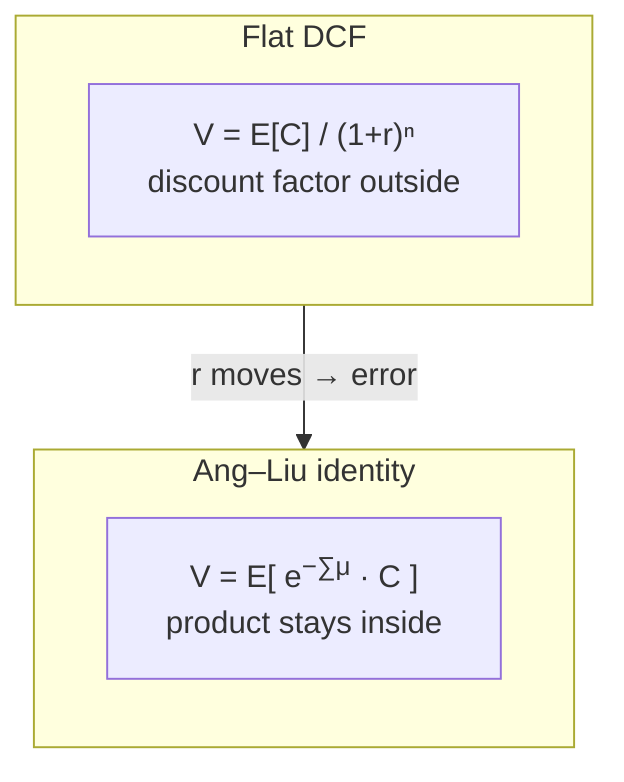
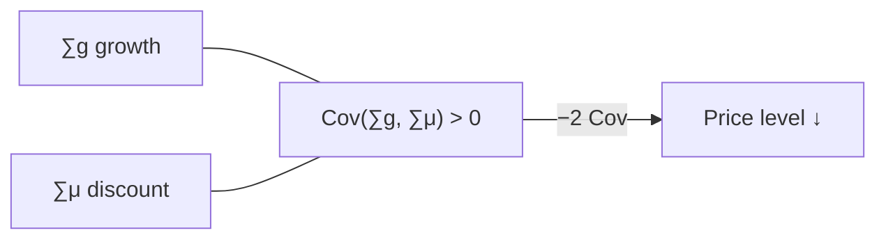

# The problem

## Where this sits on the map

1. **Product.** Asset pricing is an expectation of a product: cash flow times a path of discount factors.
2. **Covariance.** $E[XY] = E[X]E[Y] + \mathrm{Cov}(X,Y)$. That covariance term is part of the *price*, not a diagnostic computed afterwards.
3. **One system.** Cash-flow growth and expected returns must be modeled jointly — one VAR — or the covariance is missing by construction.

This page writes out claims 1 and 2. Claim 3 is the next page.

---

## 1. Value is the expectation of a product

You already know the workhorse formula:

$$
V_t = \sum_{j=1}^{\infty} \frac{E_t[C_{t+j}]}{(1+r)^j}.
$$

One rate $r$ for every horizon. The discount factor has been pulled out of the expectation. That step is legitimate only if the discount rate is deterministic.

Start instead from the definition of the one-period expected (log) return $\mu_t$:

$$
e^{\mu_t}
  = E_t\!\left[\frac{P_{t+1}+C_{t+1}}{P_t}\right].
$$

$\mu_t$ is known today. Iterate forward. Ang and Liu (2004), equation (2):

$$
V_t
  = \sum_{s=1}^{\infty}
    E_t\!\left[
      \exp\!\Bigl(-\sum_{k=0}^{s-1} \mu_{t+k}\Bigr)\,C_{t+s}
    \right].
$$

**In plain English:** the object inside the expectation is a **product** — a cash flow multiplied by a path of one-period discount factors. You cannot price it from two separate forecasts of “cash” and “rate”.

!!! note "Punchline"
    Damodaran’s formula replaces $E[\text{product}]$ by a ratio of expectations. Once expected returns move, that replacement is an error — not an approximation of secondary order.

---

## 2. The covariance term {#the-covariance-term}

Write cash flows in growth form, $C_{t+n} = C_t\exp(\sum_{i=1}^{n} g_{t+i})$, and a single strip of the price–cash-flow ratio becomes

$$
E_t\!\left[
  \exp\!\Bigl(\sum_{i=1}^{n}(g_{t+i}-\mu_{t+i})\Bigr)
\right].
$$

Under a Gaussian law the sum $S_n = \sum(g-\mu)$ is normal, so

$$
E_t[e^{S_n}]
  = \exp\!\Bigl(
      E_t[S_n] + \tfrac12\mathrm{Var}_t[S_n]
    \Bigr).
$$

Expand the variance:

$$
\mathrm{Var}_t[S_n]
  = \mathrm{Var}_t\Bigl[\sum g\Bigr]
  + \mathrm{Var}_t\Bigl[\sum \mu\Bigr]
  - 2\,\mathrm{Cov}_t\Bigl[\sum g,\;\sum \mu\Bigr].
$$

Four pieces enter the price level:

| Term | Effect on value |
|---|---|
| $E_t[\sum g]$ | point-forecast growth (the Damodaran part) |
| $\tfrac12\mathrm{Var}(\sum g)$ | growth uncertainty *raises* value (convexity) |
| $\tfrac12\mathrm{Var}(\sum \mu)$ | discount-rate uncertainty *raises* value |
| $-2\,\mathrm{Cov}(\sum g,\sum \mu)$ | **the economically important one** |

If good news about growth arrives together with *higher* expected returns — the usual aggregate pattern — then $\mathrm{Cov}>0$, the $-2\,\mathrm{Cov}$ term is negative, and **value is lower** than any DCF that ignores the interaction.

!!! note "Punchline"
    The covariance is not a variance-decomposition detail. It shifts the level of the price. A model that forecasts cash and discount rates in separate drawers has already set it to zero.

---

## 3. One system, or the covariance is gone

If you forecast cash in one model and the required return in another:

1. The two forecasts need not share a horizon.
2. They can contradict each other.
3. There is nowhere for $\mathrm{Cov}(\sum g,\sum \mu)$ to live.

A **vector autoregression** for a state $X_t$ that contains both cash-flow growth and the variables that move expected returns is the smallest statistical object that produces both forecasts *and* their comovement from one list of variables. One shock covariance matrix $\Sigma$ generates the joint surprises; one companion $\Phi$ carries the cross-forecasts. That is the next page.

---

## What a flat rate gets wrong

Even given the right joint model, practice often collapses the curve to one CAPM number $\mu_t = r_t + \beta_t\lambda_t$ used at every maturity. Write $V_t(n)$ for the strip at horizon $n$. A spot rate $\mu_t(n)$ is defined by

$$
V_t(n)
  = \frac{E_t[C_{t+n}]}{\exp\bigl(n\,\mu_t(n)\bigr)}.
$$

A flat rule sets $\mu_t(n)=\mu_t$ for all $n$. Ang and Liu show the curve is not flat: at short horizons the market risk premium dominates; at long horizons the risk-free rate and time-varying betas do. Using a constant rate produces large misvaluations.

Mean reversion in the expected return already produces a non-flat curve:

## What we will compute

Given a fitted VAR for $X_t$ and $\mu_t = \alpha + \xi'X_t + X_t'\Lambda X_t$:

- the **cash-flow recursion** — $E_t[C_{t+n}]/C_t$,
- the **priced recursion** — each strip of the price–cash-flow ratio,
- the **spot curve** $\mu_t(1),\ldots,\mu_t(N)$,
- the **present value** as the sum of those strips.

All four objects share the same $(\Phi,c,\Sigma)$. The covariance term is estimated once and enters both recursions.

---

## After this page

You should be able to:

1. State why value is an expectation of a product, not a ratio of expectations.
2. Point to the $-2\,\mathrm{Cov}(\sum g,\sum \mu)$ term and explain why it lowers value when growth and discount rates comove positively.
3. Explain why forecasting cash and rates in separate models automatically sets that covariance to zero.
