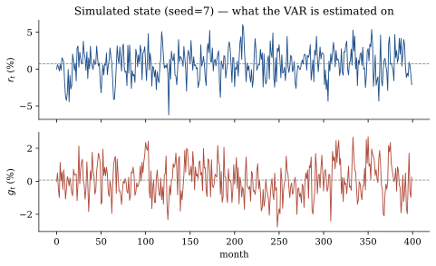
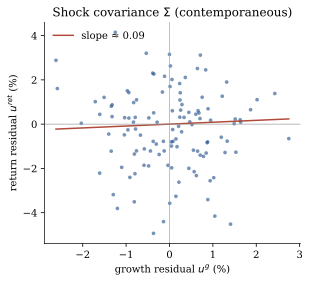
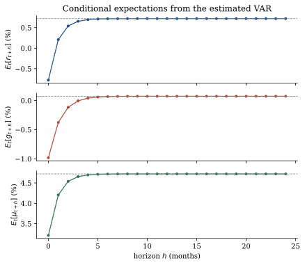
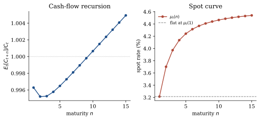
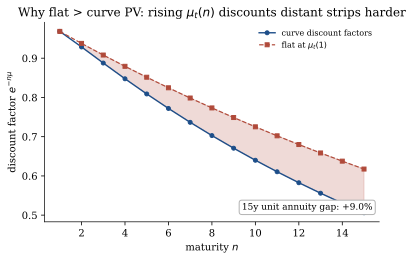

# Worked example

## Where this sits on the map

All three claims are already in place. This page runs them end-to-end on a **synthetic state** (no downloads):

1. **Product** — value is \(E[\text{discount path}\times\text{cash flow}]\).
2. **Covariance** — \(\mathrm{Cov}(\sum g,\sum\mu)\) enters the price level.
3. **One VAR** — both forecasts share \((\Phi,c,\Sigma)\).

We estimate that VAR, read the two Ang–Liu recursions, form the spot curve \(\mu_t(n)\), and measure how much a flat rate at \(\mu_t(1)\) misprices a 15-year annuity.

```text
python examples/quickstart.py
```

---

## The synthetic laboratory

Everything below uses the same offline draw:

```python
from varvaluation.news import simulate_return_var
df, spec = simulate_return_var(nobs=400, seed=7)
```

Two variables only: a return \(r_t\) and cash-flow growth \(g_t\). The figure shows the paths the VAR is estimated on. Both series mean-revert; the sample means are near 0.4 % and 0.25 % per month.



---

## Step 1 — What a VAR estimate is

A VAR(1) is just two regressions estimated **together**:

\[
\begin{aligned}
r_{t+1} &= c_r + \Phi_{rr}\,r_t + \Phi_{rg}\,g_t + u^r_{t+1}, \\
g_{t+1} &= c_g + \Phi_{gr}\,r_t + \Phi_{gg}\,g_t + u^g_{t+1}.
\end{aligned}
\]

| Object | Job |
|---|---|
| \(c\) | intercept / long-run mean |
| \(\Phi\) diagonal | own persistence (mean reversion speed) |
| \(\Phi\) off-diagonal | cross-forecasts (does growth today help predict returns tomorrow?) |
| \(\Sigma\) | **shock covariance** — which surprises arrive together |

On this draw (seed 7):

```text
spectral radius : 0.409  (< 1 ⇒ stationary)
Φ:
   ret  +0.295  +0.124
     g  +0.006  +0.402
c               : [0.0027 0.0015]
```

Both eigenvalues sit well inside the unit circle. The off-diagonal entries of \(\Phi\) and of \(\Sigma\) are the concrete carriers of the covariance the product identity needs.

The residual scatter makes the contemporaneous piece of \(\Sigma\) visible:



A separate growth model and a separate return model would never produce this joint residual cloud. That is why step 3 of the mental map insists on **one** system.

---

## Step 2 — Expected returns and multi-step forecasts

Map the state into the one-period expected return

\[
\mu_t = \alpha + \xi'X_t + X_t'\Lambda X_t
\]

(with \(\Lambda=0\) here, so affine). From the last lag \(X_t\) the estimated \(\Phi\) also delivers the whole path of conditional expectations:

\[
E_t[X_{t+h}] = (I-\Phi^h)(I-\Phi)^{-1}c + \Phi^h X_t.
\]



The dashed lines are the unconditional means. Because \(\Phi\) is stable, every path glides back. That mean reversion is already enough to make the spot curve \(\mu_t(n)\) rise with maturity (next steps).

---

## Step 3 — Cash-flow recursion

The cash-flow side of the product is closed-form:

\[
\frac{E_t[C_{t+n}]}{C_t} = \exp\bigl(\bar a(n) + \bar b(n)'X_t\bigr).
\]

\(\bar a\) accumulates mean growth plus a Jensen term from \(\Sigma\); \(\bar b\) accumulates how today’s state maps into future growth via \(\Phi\). No discounting enters yet.

```text
   n      E[C]/C
   1       0.999
   5       1.008
  10       1.021
  15       1.034
```



---

## Step 4 — Priced recursion and the spot curve

The priced recursion evaluates \(E_t[\exp(\sum(g-\mu))]\) under the same \((\Phi,c,\Sigma)\). The covariance term from the mental map is folded into the coefficients \((a,b,H)\) automatically; you never compute \(\mathrm{Cov}(\sum g,\sum\mu)\) by hand.

The spot rate \(\mu_t(n)\) is defined so that

\[
\frac{E_t[C_{t+n}]/C_t}{\exp\bigl(n\,\mu_t(n)\bigr)}
\]

recovers the priced strip. Identity that must hold:

```text
μ_t(1) = 2.3709%
α + ξ'X + X'ΛX = 2.3709%  ✓
```

```text
   n    μ_t(n) %
   1        2.37
   5        3.78
  10        4.09
  15        4.19
```

The curve is **not** flat. A single WACC locked at \(\mu_t(1)\) therefore misprices every longer strip.

---

## Step 5 — Present value = sum of strips

\[
\frac{V_t}{C_t}
  = \sum_{n=1}^{N}
      \frac{E_t[C_{t+n}]/C_t}{\exp\bigl(n\,\mu_t(n)\bigr)}
  + \text{tail at }\mu_t(N).
\]

On this state the strip-sum value is **24.07**. For a pure 15-year unit annuity the gap between the curve-consistent PV and a flat rate at \(\mu_t(1)\) is **+12.8 %**.



The shaded region is exactly the mispricing channel the handbook is about: rising \(\mu_t(n)\) discounts distant cash harder than a constant short rate does. That slope itself comes from mean reversion in the joint VAR (step 2) and from the covariance that lives in \(\Phi\) and \(\Sigma\) (step 1).

---

## Full terminal sprint

```text
============================================================
Worked example — cash flows and discount rates from one VAR
============================================================

Mental map
  1. Product     value = E[discount path × cash flow]
  2. Covariance  Cov(∑g, ∑μ) enters the *price level*
  3. One VAR     both forecasts share (Φ, c, Σ)

────────────────────────────────────────────────────────────
Step 1 — Estimate one joint VAR
────────────────────────────────────────────────────────────
  state names     : ('ret', 'g')
  cash-flow row   : 'g'
  nobs            : 399
  spectral radius : 0.409  (< 1 ⇒ stationary)

  Φ (companion):
     ret  +0.295  +0.124
       g  +0.006  +0.402
  c (intercept)   : [0.0027 0.0015]
  Σ diagonal      : [3.59765e-04 8.85390e-05]

  Off-diagonal cells of Φ and Σ carry the covariance
  that the product identity requires.

────────────────────────────────────────────────────────────
Step 2 — Expected-return loadings (α, ξ, Λ)
────────────────────────────────────────────────────────────
  α               : 0.040
  ξ               : [1.   0.01]
  Λ               : [[0. 0.]
 [0. 0.]]
  μ_t = α + ξ'X + X'ΛX

  state X (last lag): [-0.0162 -0.0051]

────────────────────────────────────────────────────────────
Step 3 — Cash-flow recursion  E_t[C_{t+n}]/C_t
────────────────────────────────────────────────────────────
     n      E[C]/C
     1       0.999
     5       1.008
    10       1.021
    15       1.034

────────────────────────────────────────────────────────────
Step 4 — Spot curve μ_t(n)  (priced recursion / cash-flow)
────────────────────────────────────────────────────────────
  identity check: μ_t(1) = 2.3709%
                  α+ξ'X+X'ΛX = 2.3709%  ✓

     n    μ_t(n) %
     1        2.37
     5        3.78
    10        4.09
    15        4.19

  The curve is not flat. A single WACC at μ_t(1) misprices
  every longer strip.

────────────────────────────────────────────────────────────
Step 5 — Present value = sum of strips
────────────────────────────────────────────────────────────
  strip-sum value (C=1, n=40) : 24.07
  15-year unit annuity, curve : 11.0631
  15-year unit annuity, flat  : 12.4737
  flat vs curve               : +12.8%

  The gap is the object the handbook is about: how much a
  constant-rate DCF misses when expected returns move.

────────────────────────────────────────────────────────────
Diagnostic — news variance shares
────────────────────────────────────────────────────────────
  var(cash-flow news)     : 0.0002
  var(discount-rate news) : 0.0001

Done.
```

---

## Flat vs curve in isolation

```text
$ python examples/flat_vs_curve.py
Flat rate versus Ang–Liu curve (synthetic state, seed=7)
  μ_t(1)              2.37%
  μ_t(15)             4.19%
  15-year unit PV     curve=11.0631
  flat PV vs curve    +12.8%

  The gap is the covariance channel: a flat rate locked at
  μ_t(1) ignores the term structure that the joint VAR produces.
```

---

## Minimal code path

```python
from varvaluation import ExpectedReturnSpec, ValuationModel, estimate_var
from varvaluation.news import simulate_return_var

df, spec = simulate_return_var(nobs=400, seed=7)
fit = estimate_var(df, spec)
xi, Lambda = ExpectedReturnSpec(rate="ret", beta="g", premium=()).xi_lambda(
    spec, {"b0": 0.01}
)
model = ValuationModel.from_var(fit, xi=xi, Lambda=Lambda, alpha=0.04)
X = fit.X_lag[-1]

spots = model.spot_rates(X, n=15)            # μ_t(n)
cf    = model.cashflow_expectation(X, n=15)  # cash-flow recursion
V     = model.value(X, C=1.0, n=40)          # sum of strips + tail
```

Checks that should hold inside the model class:

| Check | Why |
|---|---|
| \(\mu_t(1)\) equals the one-period \(\mu_t\) | Definition of the spot curve |
| \(\Lambda = 0\) ⇒ \(H(n)\equiv 0\) | Affine special case |
| Spectral radius of \(\Phi\) \(< 1\) | Otherwise `from_var` refuses |
| Tail of `value` uses \(\mu_t(N)\), not a hand-set \((r,g)\) | Gordon only as special case 1 |

---

## Map ↔ code summary

| Step | Object | Map claim |
|---|---|---|
| 1 | \(\Phi\), \(c\), \(\Sigma\) | **One VAR** — joint law of motion |
| 2 | \(\alpha\), \(\xi\), \(\Lambda\) + multi-step \(E[X]\) | maps the state into \(\mu_t\) and its path |
| 3 | \(\bar a(n),\bar b(n)\) | cash side of the **product** |
| 4 | \(a(n),b(n),H(n)\to\mu_t(n)\) | priced side; **covariance** is inside |
| 5 | strip sum | \(E[\text{product}]\) as a number |

---

## After this page

You should be able to:

1. Run `examples/quickstart.py` and obtain a spot curve, a cash-flow path, and a strip-sum value.
2. Point to the residual scatter and the off-diagonal cells of \(\Phi\) as the concrete location of the covariance the product needs.
3. Read a multi-step forecast path from \(\Phi\) and explain why mean reversion already tilts \(\mu_t(n)\).
4. Verify that \(\mu_t(1)\) matches \(\alpha + \xi'X + X'\Lambda X\).
5. Explain why the flat-vs-curve gap is the covariance / term-structure channel the handbook quantifies.

The next page only changes which names are averaged into \(X_t\); the three-step map and the two recursions stay identical.
