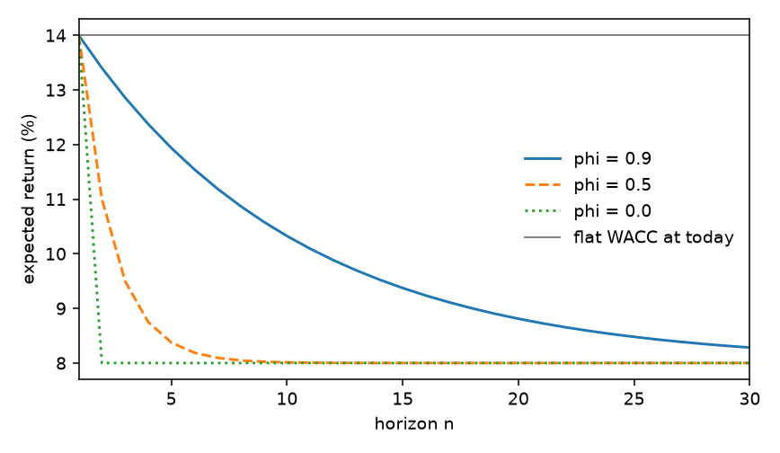

# 2.1 The joint system

Value is the conditional expectation of a product
([Ang and Liu, 2004](../references.md#ang-liu-2004)). The expectation
of a product is a property of the joint distribution. A vector
autoregression is the smallest statistical object that produces both
forecasts, and their covariance, from one state $X_t$. Separate
models of cash flows and of expected returns omit that covariance,
need not share a horizon structure, and can contradict each other.
The failure is one of identification, not of taste.

## What a VAR is

A VAR is a system of ordinary linear regressions run at the same time.
Stack the variables you care about into a vector and regress **each** of
them on **all** of them, lagged one period. With two variables $x$ and
$y$, a VAR(1) is literally two regressions:

$$
\begin{aligned}
x_{t+1} &= a_1 + b_{11} x_t + b_{12} y_t + u_{t+1}, \\
y_{t+1} &= a_2 + b_{21} x_t + b_{22} y_t + v_{t+1}.
\end{aligned}
$$

Nothing is labelled a cause. $y$ can forecast $x$ ($b_{12}\ne 0$) and
$x$ can forecast $y$ ($b_{21}\ne 0$). In matrix form,

$$
X_{t+1} = c + \Phi X_t + u_{t+1}, \qquad u\sim N(0,\Sigma).
$$

Three named objects, each with a job:

| Object | Job |
|---|---|
| $c$ | pulls every variable toward a long-run average |
| $\Phi$ | persistence: the diagonal is memory, the off-diagonals are cross-forecasts |
| $\Sigma$ | which shocks arrive together |

Gaussian shocks plus linear dynamics is what makes every future horizon
computable in closed form — the same architecture as affine
term-structure models, applied to equity
([Ang and Liu, 2004](../references.md#ang-liu-2004), Proposition I.1).

### Forecasting is recursive bookkeeping

One step ahead: $\mathbb{E}_t[X_{t+1}] = c + \Phi X_t$. Two steps: plug
the one-step forecast back in,

$$
\mathbb{E}_t[X_{t+2}] = (I+\Phi)c + \Phi^2 X_t.
$$

By $j$ steps,

$$
\mathbb{E}_t[X_{t+j}] = (I+\Phi+\cdots+\Phi^{j-1})c + \Phi^j X_t.
$$

Today’s state dies out at the speed of $\Phi^j$. The unconditional mean
is $(I-\Phi)^{-1}c$, provided every eigenvalue of $\Phi$ sits inside the
unit circle. Every “mean reversion” statement in this library is one of
those two formulas read aloud.

A VAR($p$) is not more general in a way that matters here: it can be
rewritten as a taller VAR(1) by stacking lags (the companion form). The
honest constraint is **linearity plus Gaussianity**, which buys the
closed form at the price of no stochastic volatility in the state.

### Affine means constant plus linear

A function is **affine** in $X$ if it equals $a + b'X$: a constant plus
each element of $X$ multiplied by its own coefficient. No powers, no
products. Expected growth being affine in the state just says: a
baseline plus an adjustment for wherever the economy currently is.

When prices are exponentials of affine (or quadratic-Gaussian) objects,
every strip stays computable. That is the load-bearing modelling choice.

### Timing

Write cash-flow growth and the one-period expected return as

$$
g_{t+1} = e_1' X_{t+1}, \qquad
\mu_t = \alpha + \xi' X_t + X_t'\Lambda X_t.
$$

$\mu_t$ is known at $t$: it is the *expected* return, part of today’s
information. $g_{t+1}$ is realized at $t+1$. That asymmetry is what
makes the model a model of expected-return variation rather than
realized-return noise.

The product $\beta_t\lambda_t$ inside a conditional CAPM is why $\mu_t$
is **quadratic** in $X_t$ whenever both beta and the premium move. If
either is constant, $\Lambda=0$ and the priced solution collapses to
exponential-affine. Same class; see [Valuation](valuation.md).

## Why a VAR is the right tool

Four requirements, four matches.

**Jointness by construction.** One $\Sigma$ generates the shocks to
cash flows *and* expected returns together. The covariance the price
needs cannot be set to zero by accident, because there is nowhere to
set it.

**Mean reversion for free.** A stable $\Phi$ delivers
$\mathbb{E}_t[\mu_{t+j}]$ gliding back to its unconditional mean at a
speed the data choose. A flat-forever WACC is the special case
$\Phi=0$, $X$ frozen.

**Predictability is symmetric and testable.** Do short rates forecast
dividend growth? Does $\mathit{cay}$ forecast betas? Those are
coefficients of $\Phi$, with Newey–West standard errors. The dynamic
relations are estimated and can be rejected.

**Gaussian linearity makes the price closed-form.** Linear dynamics
plus normal shocks imply that every cumulated $S_n=\sum_{i\le n}(g_{t+i}-\mu_{t+i-1})$
is conditionally normal, so $\mathbb{E}_t[e^{S_n}]$ is a two-line
lognormal formula. Change the distribution and you lose the analytic
price.

## Eigenvalues, in words

A variable **mean-reverts** if, when it sits above its long-run
average, it tends to fall back (and vice versa). The speed of that
snap-back is governed by the **eigenvalues** of $\Phi$. An eigenvalue
of $0.9$ means a deviation is still 90% alive after one period, and
$0.9^{10}\approx 35\%$ alive after ten. Near $1$: long memory. Near
$0$: fast forgetting.

`fit.spectral_radius` is the largest absolute eigenvalue. The model
refuses to construct if that number is $\ge 1$: the unconditional mean
does not exist, and the recursions have nowhere to settle.

$\mathbb{E}_t[\mu_{t+n}] = \bar\mu + \phi^{\,n-1}(\mu_1-\bar\mu)$. High persistence ($\phi=0.9$) keeps today’s rate alive for a decade. A flat WACC keeps it alive forever.

## Where the joint distribution enters the price

Because $X$ is Gaussian and $g$, $\mu$ are (at most) quadratic in $X$,
the sum $S_n$ is conditionally normal given $X_t$. If $S$ is normal,
$e^S$ is lognormal and

$$
\mathbb{E}_t[e^{S_n}]
  = \exp\!\bigl(\underbrace{\mathbb{E}_t[S_n]}_{\text{point forecasts}}
    + \tfrac12\underbrace{\mathrm{Var}_t[S_n]}_{\text{the new part}}\bigr).
$$

The average of the exponential beats the exponential of the average.
The gap grows with variance. That is Jensen’s inequality: $S\mapsto e^S$
is convex, so uncertainty **raises** the strip before risk is priced.

Expand the variance:

$$
\mathrm{Var}_t[S_n]
  = \mathrm{Var}_t[\textstyle\sum g]
  + \mathrm{Var}_t[\textstyle\sum \mu]
  - 2\,\mathrm{Cov}_t[\textstyle\sum g,\ \textstyle\sum \mu].
$$

- Uncertainty about growth raises value (convexity).
- Uncertainty about discount rates also raises value (same reason).
- The **covariance** is the economically important term. If good news
  about growth arrives together with *higher* discount rates, then
  $\mathrm{Cov}>0$, the $-2\,\mathrm{Cov}$ term is negative, and value
  is **lower** than any DCF that ignores the interaction.

That is why both forecasts have to come from one system. It is not only
about variance decompositions after the fact
([Campbell, 1991](../references.md#campbell-1991)). **The joint
distribution enters the price level.** The $-2\,\mathrm{Cov}$ term is
the precise, quantitative reason a split DCF is not an approximation
but a different (and generally inconsistent) object.

The [Valuation](valuation.md) page turns this Gaussian expectation into
two recursions. [Estimation](estimate.md) shows how $(\Phi,c,\Sigma)$
are measured.
