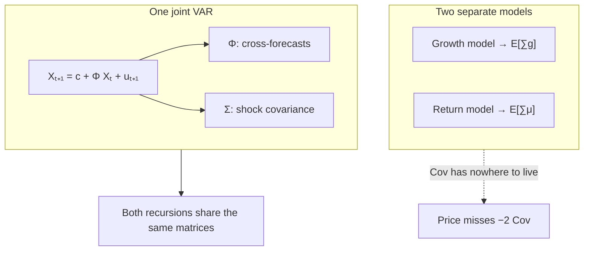

# One system

## Where this sits on the map

1. Value is $E[\text{product}]$.
2. The product carries a covariance term that moves the price level.
3. **Cash-flow growth and expected returns must share one law of motion** — or that covariance has nowhere to come from.

This page is step 3. You will simulate a state, estimate one VAR, and read the matrices that carry the covariance.



---

## Why separate models fail

Suppose you estimate a growth equation in one place and a return-prediction equation in another. You can still form $E_t[\sum g]$ and $E_t[\sum \mu]$. You cannot form

$$
\mathrm{Cov}_t\Bigl[\sum g,\;\sum \mu\Bigr]
$$

from those two objects alone. The covariance is a property of the **joint** distribution of growth and expected returns. Without it, the formula from the previous page

$$
E_t[e^{S_n}]
  = \exp\!\bigl(E_t[S_n] + \tfrac12\mathrm{Var}_t[S_n]\bigr)
$$

is missing the $-2\,\mathrm{Cov}$ piece of the variance. The price you compute is the price of an economy in which growth shocks and discount-rate shocks never move together.

A single VAR closes the gap by construction.

---

## The VAR

A **state vector** $X_t$ is a list of variables observed at date $t$. On the synthetic laboratory used throughout this course the state is two-dimensional:

$$
X_t = \begin{pmatrix} r_t \\ g_t \end{pmatrix},
$$

with $r_t$ a return coordinate and $g_t$ cash-flow growth. (A richer system just adds more rows: beta, premium, short rate, …)

### From a list of equations

Write one ordinary regression for each coordinate:

$$
\begin{aligned}
r_{t+1}
  &= c_r
   + \phi_{rr}\, r_t
   + \phi_{rg}\, g_t
   + u^r_{t+1}, \\
[0.5em]
g_{t+1}
  &= c_g
   + \phi_{gr}\, r_t
   + \phi_{gg}\, g_t
   + u^g_{t+1}.
\end{aligned}
$$

- $c_r,\,c_g$ are intercepts.
- $\phi_{rr},\,\phi_{gg}$ (the **diagonal**) are own-persistence: how much of today’s value carries into tomorrow.
- $\phi_{rg},\,\phi_{gr}$ (the **off-diagonal**) are cross-forecasts: does growth today help predict returns tomorrow, and vice versa?
- $u^r_{t+1},\,u^g_{t+1}$ are the surprises (innovations).

Nothing here is exotic — two regressions estimated at the same time.

### Stack into matrices

Put the left-hand sides on top of each other, then do the same for every column of coefficients:

$$
\underbrace{
  \begin{pmatrix} r_{t+1} \\ g_{t+1} \end{pmatrix}
}_{X_{t+1}}
=
\underbrace{
  \begin{pmatrix} c_r \\ c_g \end{pmatrix}
}_{c}
+
\underbrace{
  \begin{pmatrix}
    \phi_{rr} & \phi_{rg} \\
    \phi_{gr} & \phi_{gg}
  \end{pmatrix}
}_{\Phi}
\underbrace{
  \begin{pmatrix} r_t \\ g_t \end{pmatrix}
}_{X_t}
+
\underbrace{
  \begin{pmatrix} u^r_{t+1} \\ u^g_{t+1} \end{pmatrix}
}_{u_{t+1}}.
$$

Read a row of $\Phi$ as “the coefficients of one equation.” Read a column as “how one lag enters every equation.” The matrix form is **only** the list of equations written once.

The same stacking for the shocks:

$$
\Sigma
  = \mathrm{Var}(u_{t+1})
  = \begin{pmatrix}
      \mathrm{Var}(u^r) & \mathrm{Cov}(u^r,u^g) \\
      \mathrm{Cov}(u^g,u^r) & \mathrm{Var}(u^g)
    \end{pmatrix}.
$$

The off-diagonal of $\Sigma$ is the contemporaneous covariance: growth surprises and return surprises arriving in the same period. Together, the off-diagonals of $\Phi$ and of $\Sigma$ are exactly the covariance structure the product identity requires.

### Compact form

$$
X_{t+1} = c + \Phi X_t + u_{t+1},
\qquad
u_{t+1}\sim N(0,\Sigma).
$$

| Symbol | Name | Where the equation parameters sit |
|---|---|---|
| $c$ | intercept vector | $(c_r,\,c_g)'$ |
| $\Phi$ | companion matrix | row 1 $=(\phi_{rr},\phi_{rg})$, row 2 $=(\phi_{gr},\phi_{gg})$ |
| $u_{t+1}$ | innovation | $(u^r,\,u^g)'$ |
| $\Sigma$ | shock covariance | variances on the diagonal, $\mathrm{Cov}(u^r,u^g)$ off it |

!!! note "Four reasons the VAR is the minimum object"
    1. **Jointness.** One $\Sigma$ generates growth and discount-rate shocks together. The covariance cannot be zeroed by accident.
    2. **Mean reversion.** If all eigenvalues of $\Phi$ have absolute value less than 1 (the **spectral radius** of $\Phi$ is $<1$), rates glide back to their long-run mean. Flat-forever is the corner $\Phi=0$.
    3. **Testable cross-forecasts.** Does the premium forecast growth? Those are coefficients of $\Phi$, with standard errors.
    4. **Closed form.** Linear dynamics plus normal shocks imply that every cumulated sum is conditionally normal, so $E[e^{\cdot}]$ has an analytic formula.

---

## Follow along — simulate the state and estimate the VAR

Reuse the laboratory from [The problem](problem.md) (seed 7). First create the synthetic series and fit one joint system:

```python
import numpy as np
from varvaluation import estimate_var, simulate_state

df, spec = simulate_state(nobs=400, seed=7)
fit = estimate_var(df, spec)

print("names           :", spec.names)
print("cash-flow row   :", spec.cashflow)
print("spectral radius :", f"{fit.spectral_radius:.3f}")
print("Φ:\n", np.round(fit.Phi, 3))
print("c :", np.round(fit.c, 4))
print("Σ diagonal:", np.round(np.diag(fit.Sigma), 6))
```

```text
names           : ('ret', 'g')
cash-flow row   : g
spectral radius : 0.409
Φ:
 [[0.295 0.124]
  [0.006 0.402]]
c : [0.0027 0.0015]
Σ diagonal: [0.00036 0.000089]
```

Match the numbers to the equation list:

$$
\begin{aligned}
r_{t+1}
  &= 0.0027 + 0.295\, r_t + 0.124\, g_t + u^r_{t+1}, \\
g_{t+1}
  &= 0.0015 + 0.006\, r_t + 0.402\, g_t + u^g_{t+1}.
\end{aligned}
$$

$$
\Phi = \begin{pmatrix} 0.295 & 0.124 \\ 0.006 & 0.402 \end{pmatrix},
\qquad
c = \begin{pmatrix} 0.0027 \\ 0.0015 \end{pmatrix}.
$$

Both eigenvalues of $\Phi$ sit well inside the unit circle (spectral radius $0.409<1$). The off-diagonal entries are small but non-zero — they are the cross-forecast channels that carry part of the covariance into the product.

### What the VAR is estimated on

```python
# the two series in df are the state the VAR sees
ret = df["ret"]   # return coordinate
g   = df["g"]     # growth coordinate (cash-flow row)
```


### Shock covariance $\Sigma$

Residuals of the fitted system show the contemporaneous piece of $\Sigma$. Separate models of growth and of returns would never produce this joint cloud:

```python
u = fit.residuals          # shape (T, K)
# columns align with spec.names — here u[:, 0] is ret, u[:, 1] is g
```


### Multi-step expectations

Because $\Phi$ is stable, forecasts glide back to the unconditional mean. That mean reversion is the source of a non-flat spot curve:

```python
from numpy.linalg import matrix_power, solve

X = fit.X_lag[-1]         # last observed lag
K = fit.Phi.shape[0]
eye = np.eye(K)
mu_uncond = solve(eye - fit.Phi, fit.c)

h = 12
Phi_h = matrix_power(fit.Phi, h)
E_X = (eye - Phi_h) @ mu_uncond + Phi_h @ X
print("E_t[X_{t+12}] =", np.round(E_X, 4))
```


The five pedagogical figures (including those above) are rebuilt by:

```text
python examples/build_pedagogical_figures.py
```

---

## Reading the state two ways

Nothing in the VAR is labelled “numerator” or “denominator”. The two readings come from which coordinates you ask about.

**Cash-flow growth.** Write

$$
C_{t+n} = C_t\,\exp\!\Bigl(\sum_{i=1}^{n} g_{t+i}\Bigr).
$$

$g_t$ is one coordinate of $X_t$ (or an affine function of $X_t$). Every other coordinate can forecast it through $\Phi$. The cash-flow recursion on the next page turns that row into $E_t[C_{t+n}]/C_t$.

**Expected returns.** A conditional CAPM writes the one-period expected return as

$$
\mu_t = \alpha + r_t + \beta_t\,\lambda_t,
$$

where $r_t$ is the risk-free rate, $\beta_t$ is conditional beta, and $\lambda_t$ is the **market risk premium**. When both $\beta_t$ and $\lambda_t$ move with $X_t$, the product $\beta_t\lambda_t$ is quadratic in the state:

$$
\mu_t = \alpha + \xi'X_t + X_t'\Lambda X_t.
$$

- $\alpha$ = constant
- $\xi$ = linear loadings on $X_t$
- $\Lambda$ = quadratic loadings

If either $\beta$ or $\lambda$ is constant, $\Lambda=0$ and $\mu_t$ is **affine** (linear plus constant) in $X_t$. Letting **both** move is what the matrix $H(n)$ in the priced recursion is for.

### Follow along — attach expected-return loadings

On the synthetic laboratory the return coordinate plays the role of the rate, and a small loading on growth stands in for a beta-like channel:

```python
from varvaluation import ExpectedReturnSpec, ValuationModel

xi, Lambda = ExpectedReturnSpec(rate="ret", beta="g", premium=()).xi_lambda(
    spec, {"b0": 0.01}
)
model = ValuationModel.from_var(fit, xi=xi, Lambda=Lambda, alpha=0.04)
X = fit.X_lag[-1]

mu_1 = float(0.04 + xi @ X + X @ Lambda @ X)   # one-period μ_t
print(f"μ_t = {100 * mu_1:.2f}%")
```

The next page turns this `model` into the cash-flow recursion, the priced recursion, and the spot curve $\mu_t(n)$.

---

## The covariance lives in $\Phi$ and $\Sigma$

| Cell | What it carries into the product |
|---|---|
| $\phi_{rg}$ (row $r$, column $g$) | growth today forecasts returns tomorrow |
| $\phi_{gr}$ (row $g$, column $r$) | returns today forecast growth tomorrow |
| $\Sigma_{r g}=\mathrm{Cov}(u^r,u^g)$ | growth shocks and return shocks arrive together |

Estimate cash in one model and the rate in another, and these cells are gone. The product $E[e^{-\sum\mu}C]$ is then missing its covariance — which was the whole point of keeping the product inside the expectation.

---

## After this page

You should be able to:

1. Write the two scalar regressions and rebuild $\Phi$ and $c$ by stacking their coefficients.
2. Simulate the synthetic state and estimate one VAR with `estimate_var`.
3. Read $\Phi$, $c$, $\Sigma$, and the spectral radius from the fit, and point to the off-diagonal cells as the carriers of $\mathrm{Cov}(\sum g,\sum \mu)$.
