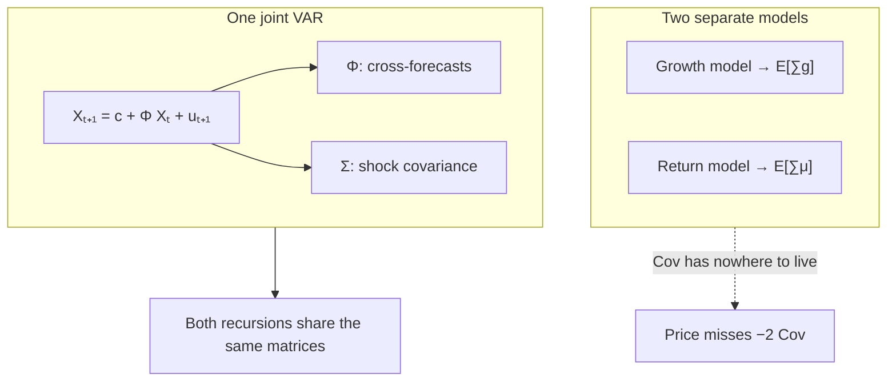

# One system

## Where this sits on the map

1. Value is $E[\text{product}]$.
2. The product expands to a covariance term that moves the price level.
3. **Cash-flow growth and expected returns must share one law of motion** — or that covariance has nowhere to come from.

This page is step 3.



---

## Why separate models fail

Suppose you estimate a growth equation in one place and a return-prediction equation in another. You can still form $E_t[\sum g]$ and $E_t[\sum \mu]$. You cannot form

$$
\mathrm{Cov}_t\Bigl[\sum g,\;\sum \mu\Bigr]
$$

from those two objects. The covariance is a property of the **joint** distribution. Without it, the lognormal strip

$$
E_t[e^{S_n}]
  = \exp\!\bigl(E_t[S_n] + \tfrac12\mathrm{Var}_t[S_n]\bigr)
$$

is missing the $-2\,\mathrm{Cov}$ piece of the variance. The price you compute is the price of an economy in which growth shocks and discount-rate shocks never move together.

A single VAR closes the gap by construction.

---

## The VAR

Ang and Liu (2004) summarise cash flows and expected returns by a state vector $X_t$. In the leading case

$$
X_t = (g_t,\; \beta_t,\; z_t')',
$$

where $g_t$ is cash-flow growth, $\beta_t$ is the conditional beta, and $z_t$ holds instruments that predict growth, betas, or the market premium.

The law of motion is a VAR(1):

$$
X_{t+1} = c + \Phi X_t + u_{t+1},
\qquad
u \sim N(0,\Sigma).
$$

**In plain English:** with two variables this is simply two ordinary regressions run at the same time:

$$
\begin{aligned}
x_{t+1} &= a_1 + b_{11}x_t + b_{12}y_t + u_{t+1}, \\
y_{t+1} &= a_2 + b_{21}x_t + b_{22}y_t + v_{t+1}.
\end{aligned}
$$

| Object | Job |
|---|---|
| $c$ | Pulls the system toward long-run averages |
| $\Phi$ | Persistence (diagonal) and cross-forecasts (off-diagonal) |
| $\Sigma$ | **Shock covariance** — which variables are hit together |

The off-diagonal cells of $\Phi$ and of $\Sigma$ *are* the covariance structure the product identity requires. Estimate the system once; both recursions on the next page read from the same matrices.

!!! note "Four reasons the VAR is the minimum object"
    1. **Jointness.** One $\Sigma$ generates growth and discount-rate shocks together. The covariance cannot be zeroed by accident.
    2. **Mean reversion.** A stable $\Phi$ delivers rates that glide back to their long-run mean. Flat-forever is the corner $\Phi=0$.
    3. **Testable cross-forecasts.** Does the premium forecast growth? Coefficients of $\Phi$, with standard errors.
    4. **Closed form.** Linear dynamics + Gaussian shocks ⇒ every cumulated sum is conditionally normal ⇒ $E[e^{\cdot}]$ is analytic.

---

## Numerical illustration (same offline state)

From `examples/quickstart.py` (seed 7):

```text
spectral radius: 0.409
Phi:
 [[0.295 0.124]
  [0.006 0.402]]
c: [0.0027 0.0015]
```

Both eigenvalues of $\Phi$ sit well inside the unit circle. The off-diagonal entries are small but non-zero — they are exactly the cross-forecast channels that carry part of the covariance into the product.

---

## Reading the state two ways

Nothing in the VAR is labelled “numerator” or “denominator”. The two readings come from which coordinates you ask about.

**Cash-flow growth.** Write

$$
C_{t+n} = C_t\,\exp\!\Bigl(\sum_{i=1}^{n} g_{t+i}\Bigr).
$$

$g_t$ is one coordinate of $X_t$ (or affine in $X_t$). Every other coordinate can forecast it through $\Phi$. The cash-flow recursion on the next page turns that row into $E_t[C_{t+n}]/C_t$.

**Expected returns.** A conditional CAPM,

$$
\mu_t = \alpha + r_t + \beta_t\,\lambda_t.
$$

When both $\beta_t$ and $\lambda_t$ move with $X_t$, the product is quadratic:

$$
\mu_t = \alpha + \xi'X_t + X_t'\Lambda X_t.
$$

If either factor is constant, $\Lambda=0$ and $\mu_t$ is affine. Letting **both** move is what the $H(n)$ recursion is for.

The short rate may sit inside $X_t$, or a Treasury curve may be kept outside the VAR and supplied as data. The package supports both.

---

## The covariance lives in $\Phi$ and $\Sigma$

| Cell | What it carries into the product |
|---|---|
| $\Phi[g,\lambda]$ | premium today forecasts growth tomorrow |
| $\Phi[\beta,g]$ | growth today forecasts beta tomorrow |
| $\Sigma_{g,\mu}$ | growth shocks and discount-rate shocks arrive together |

Estimate cash in one model and the rate in another, and these cells are gone. The product $E[e^{-\sum\mu}C]$ is then missing its covariance — which was the whole point of keeping the product inside the expectation.

---

## In code

```python
from varvaluation import StateSpec, estimate_var

spec = StateSpec(names=("g", "beta", "mrp", ...), cashflow="g", horizon=1)
fit = estimate_var(state, spec)   # → Φ, c, Σ  (one system)
```

The next page turns $(\Phi,c,\Sigma)$ and $(\alpha,\xi,\Lambda)$ into the cash-flow recursion, the priced recursion, and the spot curve $\mu_t(n)$ — all reading from the same matrices.

---

## After this page

You should be able to:

1. Explain why two separate forecasting equations cannot produce $\mathrm{Cov}(\sum g,\sum \mu)$.
2. Point to the off-diagonal cells of $\Phi$ and $\Sigma$ as the carriers of that covariance.
3. State why a single VAR(1) is the minimal object that makes the product identity operational.
