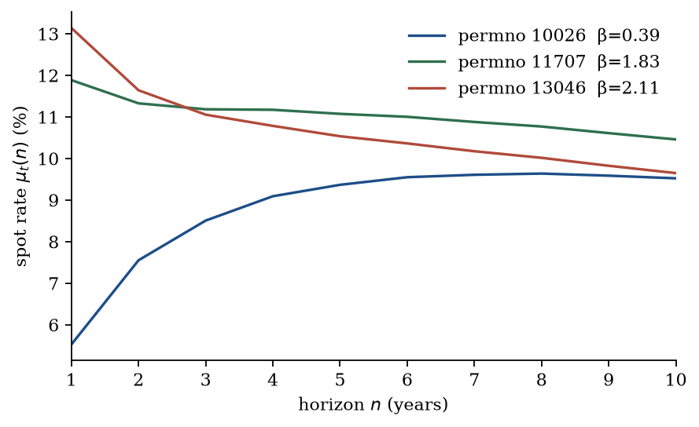

<p class="part-kicker">Part 06 · Firms</p>

# Three curves

<p class="you-will"><strong>You will.</strong> Draw the discount curve at three firms on a short window, then read what the window cannot show.</p>

The landing argued with a picture of three curves. Here you produce
that picture. The script runs the calls of Parts 03–05 on a short
extract of the WRDS files named in the previous chapter. What the
window cannot show is collected at the end of this chapter.

!!! note "In words — the files this section opens"
    **WRDS** is the academic vendor. **CRSP** is the monthly
    stock-return file (prices, returns, shares). **Compustat** is
    the annual fundamentals file (net income, book equity). A
    **permno** is CRSP’s permanent security identifier — it does not
    change when a ticker does. **GAAP** net income is the reported
    earnings number, not clean-surplus earnings. **CCM** is the
    CRSP–Compustat Merged link that joins the two files. Credentials
    live in `.env`; queries cache as parquet under
    `~/.cache/varvaluation/wrds`.

The cash-flow slot is `g`: log growth of trailing twelve-month
dividends implied by CRSP returns with and without dividends. That
is growth of cash paid to owners, so `value(X, C=div)` is a present
value of the equity. The sample is firms that pay; a firm with no
trailing dividends has no growth rate. The window is still short
(the extract below is 2014–2019). Treat the number as the object
the framework identifies, not as a published valuation of those
three names.

The script is
[`examples/walkthrough.py`](https://github.com/tlorans/varvaluation/blob/main/examples/walkthrough.py).

```text
uv add "varvaluation[data,wrds]"
uv run python examples/walkthrough.py
```

WRDS credentials live in `.env`. The extract is CRSP 2014–2019
because that is the cached window used to write these pages. A
research sample would start in 1965 or 1973. After a twelve-month
beta burn-in the prepared state is March 2015–September 2019.

## 5.1 Macro and the firm panel

```python
from varvaluation.data import load_macro
from varvaluation.wrds import load_firm_panel

macro = load_macro()
panel = load_firm_panel(start="2014-01", end="2019-12-31")
```

``` text title="Terminal"
macro  1926-07-31 → 2026-06-30  n=1200
macro columns: ['mkt_rf', 'smb', 'hml', 'rf', 'date', 'mkt', 'r', 'pi', 'cay']
CRSP–Compustat  2014-01-31 → 2019-12-31  rows=356620  permno=6790
```

The macro file on this machine extends to 2026-06. The *firm* VAR
uses only 2015-03–2019-09. The *premium* regression in §5.3 uses
1965-07–2024-12, which is look-ahead relative to 2019-09 (Section 3).
Cay is reconstructed from FRED when the published
[Lettau and Ludvigson (2001)](../references.md#lettau-ludvigson-2001)
file is missing. That reconstruction is not their cointegrating
residual.

## 5.2 The named state

```python
from varvaluation import StateSpec
from varvaluation.wrds import prepare_firm_state

spec = StateSpec(
    names=("g", "beta", "bm", "r", "cay", "pi"),
    cashflow="g",
    group="permno",
    horizon=12,
    nw_lags=12,
)
state = prepare_firm_state(
    panel, macro, spec, start="2015-01", end="2019-09", beta_window=12
)
```

``` text title="Terminal"
names=('g', 'beta', 'bm', 'r', 'cay', 'pi')  cashflow=g  cashflow_index=0  group=permno
state  67884 firm-months  2673 firms  2015-03-31 → 2019-09-30
```

`prepare_firm_state` drops financials and utilities (SIC 6000–6999
and 4900–4999) and, with `g` in the spec, keeps only firm-months
with a trailing year of positive implied dividends. The beta
window is 12 months because the extract is short. A twelve-month
**burn-in** is the first year of returns consumed to produce the
first beta. Dividend growth needs a further year of trailing cash,
so the prepared state is shorter than a profitability-only state,
and it is only payers. The counts printed below are from an earlier
profitability spec; re-run the script after a CRSP pull that
includes `retx` for the dividend-growth sample and present values.
A twelve-month burn-in is why a typical 2014 start becomes 2015,
not January 2014. The library convention is 60 months
(`BETA_WINDOW`).

## 5.3 The premium, as $(\xi,\Lambda)$

The map $X\mapsto\mu$ is a *market* premium applied to the firm’s
$\beta_t$ — staged estimation as in Ang and Liu (2004, §III), not a
firm return equation. `bm` sits in $X_t$ but not in $\lambda_t$.

```python
from varvaluation import ExpectedReturnSpec

xi, Lambda = ExpectedReturnSpec(premium=("cay",)).xi_lambda(
    spec, {"b0": 0.095, "br": -0.737, "bcay": 0.708}
)
```

``` text title="Terminal"
sample 1965-07-31 → 2024-12-31  n=714  R2=0.053
b0=+0.095 (t=+3.41)  br=-0.737 (t=-1.49)  bcay=+0.708 (t=+1.72)
xi[r]=+1.000  xi[beta]=+0.095  Lambda[beta,cay]=+0.354
```

$R^2=0.053$ is the fraction of annual market excess-return variance
this regression fits in sample — five percent, the usual order of
magnitude for a return prediction. $b_0$ is precise. The two slopes that make $\lambda_t$ *move* have
$|t|<2$. On this vintage the quadratic term $H(n)$ is not identified.
$\alpha=0.02$ in the next call is a calibration intercept, not an
estimate. It shifts every spot rate by about two percentage points.

## 5.4 The panel VAR

Lag pairs are formed only inside `permno`. The companion is **pooled**
on the **80** firms with the longest histories in this window, not
on the 2,673 firms in the prepared state: one $\Phi$ is estimated on
the stacked pairs, as if the 80 names shared a law of motion. The
common columns $(r,\mathit{cay},\pi)$ are one calendar path, copied
eighty times — they are not 80 independent macro histories.

```python
from varvaluation import estimate_var_panel

fit = estimate_var_panel(slim, spec)
print(fit.nobs, fit.spectral_radius)
print(fit.Phi[spec.cashflow_index()])
```

``` text title="Terminal"
nobs=2240  spectral_radius=0.995  Phi[roe,roe]=+0.458
Phi[roe, ·]  roe=+0.458  beta=-0.019  bm=-0.205  r=-7.207  cay=-0.640  pi=+4.205
```

$\Phi_{\mathit{roe},\mathit{roe}}=0.46$ is a pooled own-lag of
profitable-year $\log(\mathrm{NI}/\mathrm{BE})$ in 2015–2019. It is
not the Fama–French (2000) fade coefficient and not Vuolteenaho’s
AR on $e_t=\log(1+X/B)$. $\rho(\Phi)=0.995$ is the radius of the
*whole* companion, driven largely by the shared macro columns. The
`roe` row loadings on $r$ and $\pi$ ($-7.2$, $+4.2$) are short-panel
artifacts. They still enter `spot_rates`. Stacked Newey–West on
this panel is not date-clustered; no standard errors are printed.

## 5.5 The curve and the profitability path

`ValuationModel.from_var` refuses $\rho(\Phi)\ge 1$. At the last
date of the 80-firm slice the model returns $\mu_t(n)$ and
$\mathbb{E}_t[\mathit{roe}_{t+n}]$. `perpetuity` is the present
value of a **unit cash flow** under that curve — a denominator
diagnostic, not a firm value. The three names are the first, middle,
and last `permno` on that date (not a designed beta sort). They sit
in the 80-firm companion.

```python
from varvaluation import ValuationModel

model = ValuationModel.from_var(fit, xi=xi, Lambda=Lambda, alpha=0.02)
X = state.filter(pl.col("permno") == 10026).select(list(spec.names)).to_numpy()[-1]
rates = model.spot_rates(X, n=10)
unit = model.perpetuity(X, n=40)   # unit cash flow, not equity value
```

``` text title="Terminal"
permno=10026  2019-09-30  log_roe=-2.080  implied_NI/BE=0.125  beta=+0.39  bm=-1.470
  spot mu(n) %   n=1, 5, 10: 5.51, 9.31, 9.47
  E[log_roe]     n=1, 5, 10: -1.940, -1.975, -2.158   (implied NI/BE 0.144, 0.139, 0.116)
  unit_curve_pv=24.70  terminal_spot=2.84%
permno=11707  2019-09-30  log_roe=-1.774  implied_NI/BE=0.170  beta=+1.83  bm=-1.121
  spot mu(n) %   n=1, 5, 10: 11.79, 11.00, 10.39
  E[log_roe]     n=1, 5, 10: -1.899, -2.118, -2.288   (implied NI/BE 0.150, 0.120, 0.101)
  unit_curve_pv=21.27  terminal_spot=3.13%
permno=13046  2019-09-30  log_roe=+0.022  implied_NI/BE=1.022  beta=+2.11  bm=-4.404
  spot mu(n) %   n=1, 5, 10: 13.03, 10.47, 9.59
  E[log_roe]     n=1, 5, 10: -0.408, -1.005, -1.355   (implied NI/BE 0.665, 0.366, 0.258)
  unit_curve_pv=28.65  terminal_spot=2.47%
```

On this draw the low-beta name slopes up (5.5% to 9.5%). The
high-beta names start above 11% and fade. That pattern is largely
the imposed $\mu_t=\alpha+r_t+\beta_t\lambda_t$, not a fact recovered
from prices. `bm` is log book-to-market (`bm=-4.404` is a large
P/B, not a raw ratio of $-4.4$).

Profitability mean-reverts in the companion: permno 13046, sitting
at $\mathrm{NI}/\mathrm{BE}\approx 1$, is forecast toward 26% by
year ten. That is an AR path of $\log(\mathrm{NI}/\mathrm{BE})$. It
is not residual income
$(\mathrm{ROE}_{t+j}-k_{t+j})B_{t+j-1}$
([Ohlson, 1995](../references.md#ohlson-1995);
[Ang and Liu, 2001](../references.md#ang-liu-2001)). That valuation
is not computed here.

`isolate_channels(..., on="discount")` on this panel raises
`PerpetuityDivergesError`. The counterfactual curve does not exist.
That is non-identification, not a result.


<p class="figure-caption"><strong>Figure 1.</strong> $\mu_t(n)$ at 30 September 2019 for three permnos in the 80-firm companion. Twelve-month betas. Denominator only. Source: this section.</p>

A linear attribution of $\mathrm{var}(\mu_t(10))$ on this window:

``` text title="Terminal"
var share of mu(n=10): roe=-5.1%  beta=57.4%  bm=47.5%  r=0.1%  cay=0.0%  pi=-0.0%
```

These are $v_i(\Sigma v)_i/(v'\Sigma v)$: each state’s contribution
to $\mathrm{var}(\mu_t(10))$ if you attribute the quadratic form
state by state. They add to 100 within rounding. Negative cells are
**covariance**, not double-counting: a state that moves *against*
the curve can receive a negative share.
$\mathit{cay}$ contributes 0.0% of curve variance: the premium
state the design kept after dropping the dividend yield does not
move $\mu_t(10)$ here. $\mathit{bm}$ is not in $\mu_t$ and still
accounts for 47.5% through $\Phi$.

## 5.6 News as a failed identity

`news_decomposition` can be called on this companion. On this
sample the call does **not** produce a return decomposition.

```python
from varvaluation import news_decomposition

news = news_decomposition(fit, ew_returns, return_col="ret", xi=xi, Lambda=Lambda)
print(news.shares.var_cf, news.shares.var_dr, news.shares.residual_share)
```

``` text title="Terminal"
var(cf)=5.3563  var(dr)=0.0011  residual_share=2433.69  rho=0.96
```

`residual_share` is $\mathrm{var}(\text{residual})/\mathrm{var}(\text{unexpected})$.
A value of $2434$ means the unexpected-return series (monthly
**equal-weighted** simple returns: each of the 80 firms gets weight
$1/80$, not weight by market cap) is not the object
this overlapping annual VAR prices. There is no return equation.
$\rho=0.96$ is the Campbell–Shiller dividend-price constant, not a
book-to-market linearization. $\mathrm{var}(\mathrm{dr})=0.0011$
is an unidentified premium, not evidence that discount-rate news is
small. This table is **not** a confirmation of
[Vuolteenaho (2002)](../references.md#vuolteenaho-2002). It is
printed so that `news_decomposition` is illustrated and so that the
diagnostic is visible. Do not read it as a result.

## What this run showed

| Call | What was identified | What was not |
|---|---|---|
| `load_firm_panel` | 6,790 permnos in the 2014–2019 pull | A 1965–2019 research panel |
| `prepare_firm_state` | 2,673 firms after filters | The VAR sample (that is 80 names) |
| `ExpectedReturnSpec` | A market intercept | Slopes that identify $H(n)$; a no-look-ahead vintage |
| `estimate_var_panel` | $\Phi_{\mathit{roe},\mathit{roe}}=0.46$ on 80 survivors | Date-clustered SEs; usable $r$ and $\pi$ loadings |
| `spot_rates` / `perpetuity` | Three unit-curve diagnostics | Equity values; a priced residual-income identity |
| `news_decomposition` | That the identity does not close | $N_{\mathrm{CF}}$ vs $N_{\mathrm{DR}}$ shares |

[For valuators](practice.md) says what you can take from the curve
when you already have a path.

## Limits of this illustration

This run is a software demonstration, not an empirical contribution.
The window is short, the companion is 80 survivors, `roe` is a
profitability level, and the news identity does not close. The
load-bearing list is
[What this sample cannot show](practice.md#what-this-sample-cannot-show).
