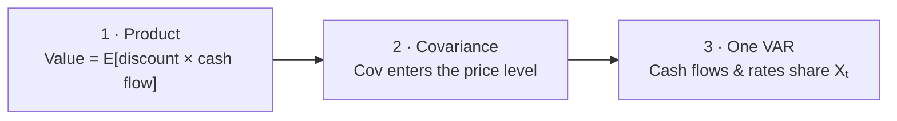
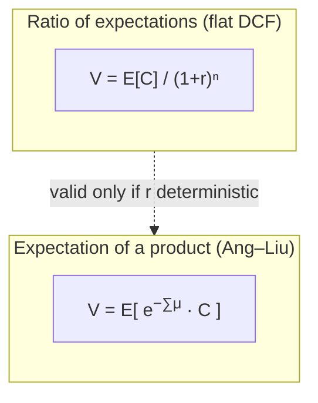

<div class="hero" markdown>

<p class="hero-kicker">Ang &amp; Liu (2004) · one joint VAR</p>

# How to discount cash flows when expected returns move

<p class="hero-lead">
Value is the expectation of a <strong>product</strong>.
A product has a <strong>covariance</strong>.
Cash flows and discount rates must therefore come from the
<strong>same</strong> system — a VAR for the state $X_t$.
This package implements the closed-form recursions of
<a href="references.md#ang-liu-2004">Ang and Liu (2004)</a>.
</p>

[The problem](guide/problem.md){ .md-button .md-button--primary }
[Install](install.md){ .md-button }

</div>

## The mental map

Three claims, in order. Everything else is bookkeeping.



<div class="topic-cards">
<a href="guide/problem/"><span class="part">1</span><strong>Product</strong><span>Value is $E[\text{discount path}\times\text{cash flow}]$, not a ratio of separate forecasts.</span></a>
<a href="guide/problem/#the-covariance-term"><span class="part">2</span><strong>Covariance</strong><span>$E[XY]=E[X]E[Y]+\mathrm{Cov}(X,Y)$. That covariance enters the <em>price level</em>.</span></a>
<a href="guide/system/"><span class="part">3</span><strong>One VAR</strong><span>Cash-flow growth and expected returns must share one law of motion, or the covariance is missing.</span></a>
</div>

From that joint system Ang and Liu give two recursions (expected cash,
priced strip) and the **spot curve** $\mu_t(n)$ — one discount rate per maturity — that makes the usual two-step workflow exact inside the model.

## From the flat DCF you know

**Discounted cash flow (DCF)** is the standard valuation formula. In practice it is often written with one constant rate $r$ for every horizon:

$$
V_t = \sum_{j=1}^{\infty} \frac{E_t[C_{t+j}]}{(1+r)^j}.
$$

Here $V_t$ is today's value, $C_{t+j}$ is the cash flow $j$ periods ahead, and $E_t[\cdot]$ means expectation given information at $t$. The discount factor $1/(1+r)^j$ has been pulled **outside** the expectation. That step is valid only if the discount rate does not move with the state of the economy.

When the one-period expected return $\mu_t$ can change over time, the correct identity keeps the product **inside** the expectation:

$$
V_t = \sum_{s=1}^{\infty}
  E_t\Bigl[
    \exp\Bigl(-\sum_{k=0}^{s-1}\mu_{t+k}\Bigr)\,C_{t+s}
  \Bigr].
$$



Because the object inside is a product, the usual identity $E[XY]=E[X]E[Y]+\mathrm{Cov}(X,Y)$ applies. The covariance between cumulated cash-flow growth and cumulated expected returns enters the **price level**. When the two comove positively, value is lower than any formula that ignores the interaction. Separate models of “cash” and “rate” set that term to zero by construction. The next pages develop this step by step.

## A numerical glimpse (offline, no data)

```text
$ python examples/quickstart.py
```

| Maturity $n$ | $\mu_t(n)$ (%) | $E_t[C_{t+n}]/C_t$ |
|---:|---:|---:|
| 1 | 2.37 | 0.999 |
| 5 | 3.78 | 1.008 |
| 10 | 4.09 | 1.021 |
| 15 | 4.19 | 1.034 |

```text
spectral radius : 0.409
strip-sum value : 24.07
flat PV vs curve: +12.8%
```

The curve rises with maturity. A flat rate locked at $\mu_t(1)$ over-discounts the near term; on this synthetic state the flat 15-year present value is about **13 % higher** than the curve-consistent value. The full annotated sprint is on the [worked example](guide/reproduce.md) page.

## Four calls

```python
from varvaluation import ValuationModel, estimate_var
from varvaluation.news import simulate_return_var

state, spec = simulate_return_var(nobs=400, seed=7)
fit = estimate_var(state, spec)
model = ValuationModel.from_var(fit, xi=..., Lambda=..., alpha=...)
# spots = model.spot_rates(X, n=30)
# cf    = model.cashflow_expectation(X, n=30)
# V     = model.value(X, C=1.0)
```

## Roadmap

<div class="topic-cards">
<a href="guide/problem/"><span class="part">01</span><strong>The problem</strong><span>Product identity, covariance term, why a flat rate fails.</span></a>
<a href="guide/system/"><span class="part">02</span><strong>One system</strong><span>Why the VAR is the minimum object that carries the covariance.</span></a>
<a href="guide/curve/"><span class="part">03</span><strong>The two recursions</strong><span>Cash-flow recursion, priced recursion, spot rates $\mu_t(n)$.</span></a>
<a href="guide/state/"><span class="part">04</span><strong>Building the state</strong><span>What goes into $X_t$.</span></a>
<a href="guide/reproduce/"><span class="part">05</span><strong>Worked example</strong><span>Estimate, recurse, read the curve.</span></a>
<a href="guide/industries/"><span class="part">06</span><strong>Other portfolios</strong><span>Same map, different universe.</span></a>
<a href="guide/literature/"><span class="part">07</span><strong>Going further</strong><span>State variables, VAR specifications, and other asset classes.</span></a>
</div>

Formulas: [Ang and Liu (2004)](references.md#ang-liu-2004).
Optional residual-income numerator: [Ang and Liu (2001)](references.md#ang-liu-2001),
[Feltham and Ohlson (1995)](references.md#feltham-ohlson-1995).
