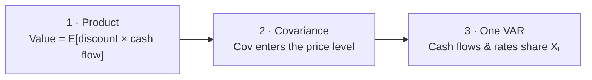

<div class="hero" markdown>

<p class="hero-kicker">One joint VAR · product identity · spot curve</p>

# How to discount cash flows when expected returns move

<p class="hero-lead">
Value is the expectation of a <strong>product</strong>.
A product has a <strong>covariance</strong>.
Cash flows and discount rates must therefore come from the
<strong>same</strong> system — a VAR for the state $X_t$.
Bring a Polars state frame; the package returns the spot curve
and present value as Polars frames.
</p>

[The problem](guide/problem.md){ .md-button .md-button--primary }
[Install](install.md){ .md-button }

</div>

## The mental map

Three claims, in order. Everything else is bookkeeping.



<div class="topic-cards">
<a href="guide/problem/"><span class="part">1</span><strong>Product</strong><span>Value is $E[\text{discount path}\times\text{cash flow}]$, not a ratio of separate forecasts.</span></a>
<a href="guide/problem/#the-covariance-term"><span class="part">2</span><strong>Covariance</strong><span>$E[XY]=E[X]E[Y]+\mathrm{Cov}(X,Y)$. That covariance enters the <em>price level</em>.</span></a>
<a href="guide/system/"><span class="part">3</span><strong>One VAR</strong><span>Cash-flow growth and expected returns must share one law of motion, or the covariance is missing.</span></a>
</div>

From that joint system come two recursions and the **spot curve** $\mu_t(n)$. Code is spread through the course on a shared synthetic Polars state (seed 7).

## Estimator path

```python
from varvaluation import (
    ExpectedReturnSpec, StateSpec, ValuationModel,
    estimate_var, simulate_state,
)

state, spec = simulate_state(nobs=400, seed=7)  # or your Polars frame
fit = estimate_var(state, spec)
xi, Lambda = ExpectedReturnSpec(rate="ret", beta="g", premium=()).xi_lambda(
    spec, {"b0": 0.01}
)
model = ValuationModel.from_var(fit, xi=xi, Lambda=Lambda, alpha=0.04)
curve = model.spot_curve(fit.X_lag[-1], n=15)   # Polars DataFrame
```

Firm panel: set `spec.group`, call `estimate_var_panel`, then `model.curve_frame(..., id_cols=("firm",))`.

## A numerical glimpse

```text
$ python examples/quickstart.py
```

| Maturity $n$ | $\mu_t(n)$ (%) | $E_t[C_{t+n}]/C_t$ |
|---:|---:|---:|
| 1 | 2.37 | 0.999 |
| 5 | 3.78 | 1.008 |
| 10 | 4.09 | 1.021 |
| 15 | 4.19 | 1.034 |

```text
spectral radius : 0.409
strip-sum value : 24.07
flat PV vs curve: +12.8%
```

## Roadmap

<div class="topic-cards">
<a href="guide/problem/"><span class="part">01</span><strong>The problem</strong><span>Product identity, covariance, flat vs curve gap.</span></a>
<a href="guide/system/"><span class="part">02</span><strong>One system</strong><span>Polars state → estimate_var → Φ, Σ.</span></a>
<a href="guide/curve/"><span class="part">03</span><strong>The two recursions</strong><span>spot_curve and value as Polars frames.</span></a>
<a href="guide/state/"><span class="part">04</span><strong>Building the state</strong><span>Your columns; optional firm panel.</span></a>
<a href="guide/literature/"><span class="part">05</span><strong>Going further</strong><span>State choices and other asset classes.</span></a>
</div>

Closed-form recursions follow [Ang and Liu (2004)](references.md#ang-liu-2004).
